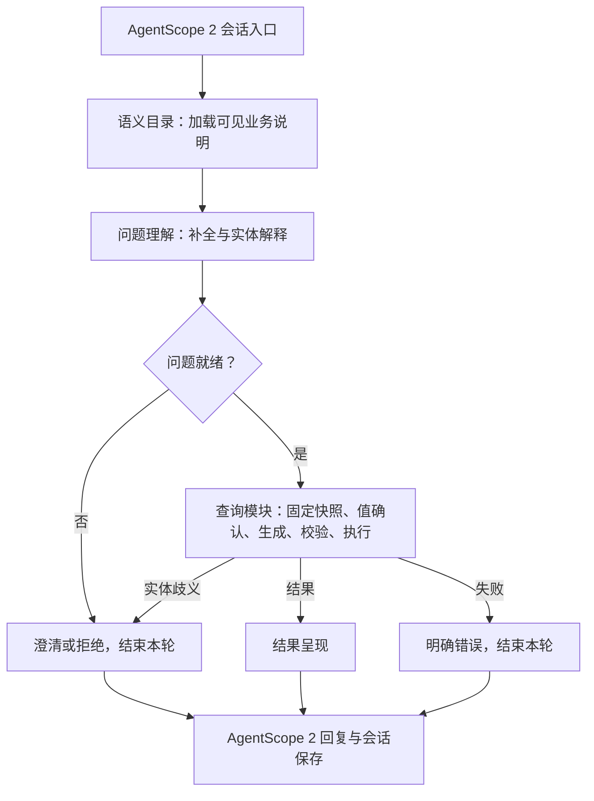
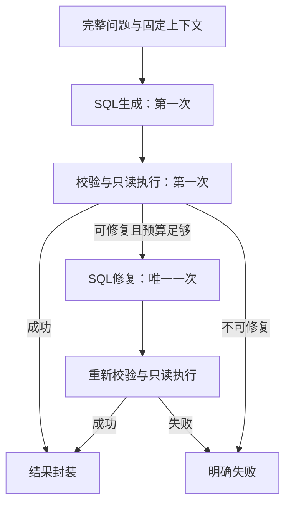

# AI 问数组件化改造计划

版本：Plan v1.15 · 2026-09-15
状态：字段标准化、澄清补充与呈现完整性修复已完成。保留六模块；本批按语义目录、理解、查询、呈现顺序修改，普通问数仍3次模型调用。最新范围与证据以第26节为准。

本版调整：第10节替换原实施顺序，第14节补充逐题证据和节点任务单。优先闭环问题理解及失败轮次承接，再改查询执行和结果呈现；数据准备的结构重构移出关键路径。以下各节保留此前实施记录；最新优化任务以第26节为准。

**目标：凡是当前数据足够、业务含义明确、能够用受控只读 SQL 表达的问题，都进入生成与验证流程。问数能力不再受三个 operation 或固定返回字段限制。**

本计划采用 AgentScope 2 + LlamaIndex Text-to-SQL + SQLGlot + SQLAlchemy。先完成 SQLite，随后用同一套问题验收 PostgreSQL。按模块顺序改造，每一步有独立输入、输出和验收标准；本轮计划不启动飞书接入、不修改业务数据。

## 1. 根因与必须一起解除的限制

目前不是数据库不会算，而是接口把能力限制住了。代码中存在三道限制：

| 位置 | 当前限制 | 改造要求 |
|---|---|---|
| 问题理解 | 必须产生有限的 QuerySpec / QueryPatch，country、event_id 只能单值 | 输出完整业务问题及明确的实体、口径，不再规定如何组合 SQL 条件 |
| 查询模块 | 只为三类 operation 构造固定 SQL | 由 Text-to-SQL 组件生成标准 SQL，执行模块统一解析、约束及执行 |
| 结果呈现 | 按 operation 检查固定列名；名单只允许五列 | 接受动态列、动态分组和计算结果，按结果契约呈现 |

只引入 LlamaIndex 而保留这三处限制，不能扩大覆盖面。重做一套 IN / AND / OR 条件 DTO 同样会形成新的能力上限，因此已停止该路径。

项目 AGENTS.md 中“模型不得生成 SQL”是旧方案的约束。实施时应根据本次已确定的 Text-to-SQL 方向，将它明确更新为“模型生成候选只读 SQL，必须经过服务端校验和执行范围约束”；其他模块边界、来源隔离、只读和失败不重跑上游的约束继续保留。本轮只记录这个必要变更，不提前改项目规则。统一编排实施时，同时更新旧“LangGraph仅位于orchestration”的表述为AgentScope 2承载在线工作流，并修订architecture.md及过时模块说明；不让旧文档继续引导新代码。

## 2. 组件如何深度融入

“深度融入”指把组件放在它真正擅长的环节，并利用上下文、解析、异步和追踪扩展点；不等于启用其所有功能，也不等于换一套会话框架。

| 组件/能力 | 本项目用法 | 启用时机与验收依据 |
|---|---|---|
| AgentScope 2 | 在线问数唯一运行入口，复用模型、会话、事件流；通过公开Pipeline协议衔接固定业务流程 | 第一阶段验证Pipeline/Agent Service适配、取消、会话隔离；不用GoalPipeline默认执行—验证循环替代问数业务流程 |
| LlamaIndex 自定义 LLM 接口 | 薄适配层连接现有 AgentScope 模型对象，负责消息、返回值、异步和异常转换 | 不复制会话、不在适配器内另加多轮重试；测试取消与异常传递 |
| SQLDatabase + SQLTableSchema 上下文 | 提供可访问表结构、列类型和逐表业务说明 | 只暴露已发布业务读模型，排除 raw_batches、追踪表、凭证与系统表 |
| NLSQLRetriever | 负责表上下文装配、问题到 SQL 的模型调用及 SQL 输出提取 | 主路径使用 sql_only=True；生成 SQL 之后必须返回，不能内部直执行 |
| PromptTemplate / 上下文配置 | 注入实体粒度、关联关系、空值口径、字段别名、已验证示例 | 业务知识在目录配置中维护，不按每一道题增加程序分支 |
| 表检索、行/列值检索扩展点 | 将来选择相关表、补充真实值候选 | 三张表阶段先全量提供结构；只在表或值域增大时启用检索 |
| 异步生成与返回元数据 | 取得候选 SQL，纳入当前 trace_id，支持取消和故障定位 | 以安装版本实际返回结构为准，不假设固定存在某个 metadata key |
| LlamaIndex instrumentation / callbacks | 将组件阶段事件关联到已有数据库追踪 | 复用两张追踪表；能取得的 token/usage 才记录，缺失时标明未知 |
| SQLGlot | SQL 解析、作用域与表列引用分析、方言处理 | 复用语法树，不用正则判断整个 SQL，不自研 SQL 解析器 |
| SQLAlchemy | 连接、参数绑定、事务、取数与结果列元数据 | 沿用已有实现；SQL生成节点和呈现模块均不绕过查询读取/执行端口取数 |

LlamaIndex 的 SQL retriever 提供 sql_only、表/值检索扩展点及异步接口；它们是本计划采用的组件能力，不代表自动获得业务正确性或自动 SQL 修复。[SQL Retriever 官方 API](https://developers.llamaindex.ai/python/framework-api-reference/retrievers/sql/)

模型桥接采用其公开的自定义 LLM 扩展机制，适配 AgentScope 2 的具体方法需要先验证。[自定义 LLM 官方指南](https://developers.llamaindex.ai/python/framework/module_guides/models/llms/usage_custom/)

优先使用 NLSQLRetriever 这一较低层组件，以保留生成、执行、呈现三者的边界；不把 NLSQLTableQueryEngine 默认的生成—执行—回答整个链条直接搬进来。QueryEngine 可作为独立对照实验，但不作为第二套在线执行入口。[SQL QueryEngine 官方 API](https://developers.llamaindex.ai/python/framework-api-reference/query_engine/NL_SQL_table/)

**先核实的兼容性问题：**官方展示的 NLSQLRetriever 初始化路径仍可能访问默认 embedding 配置，即使使用普通 SQL 解析模式。第一阶段必须验证未使用检索时不会触发默认外部模型、额外密钥或向量化调用。不能认为传入 None 就一定关闭；不能悄悄启用默认 OpenAI 模型。若选定版本无法通过公开配置隔离，先调整组件版本/公开接入方式并记录取舍，不维护框架私有分支。

## 3. 六个业务模块固定，节点按职责细分

**纠正v1.0：不新增第七个sql_generation业务模块。SQL生成属于原query_execution业务模块，与校验、取数、修复分别作为内部节点。** 模型故障与数据库执行的隔离依靠节点协议、依赖注入和错误边界完成，不依靠增加顶层模块数量。

| 固定业务模块 | 责任 | 模块内节点规划 | 当前情况 |
|---|---|---|---|
| source_ingestion | 获取并保留来源数据 | 读取来源、字段检查、原始批次保存 | 已支持Excel；后续飞书按独立来源适配器推进 |
| data_preparation | 将原始批次转成可发布标准数据 | 映射核验、字段标准化、实体/关系构建、质量校验、事务发布 | 已有describe_mapping/prepare/publish；prepare内部还未按上述节点独立拆分 |
| semantic_catalog | 管理字段、关联、粒度、指标、别名和不确定含义 | 目录加载、报告一致性校验、可见字段裁剪、SQL上下文构建、字段/别名/活动候选解释 | v3语义保持不变；七个独立nodes文件和semantic-nodes-v1 DTO已完成，旧方法删除 |
| question_understanding | 理解本轮真实业务问题 | 范围判断、会话承接、完整问题补全、实体候选选择/澄清 | 四个节点和一次模型调用已验收，公开QuestionRequest/TurnOutcome |
| query_execution | 将明确问题转成可信查询结果 | 固定执行上下文、结构/真实值读取、SQL生成、SQL校验、只读执行、结果封装 | 六节点独立CLI及SQLite模块闭环已验收；默认无模型修复 |
| answer_presentation | 根据查询结果形成回答 | 结果校验、动态列/标量格式化、空值/截断解释、证据输出 | 当前固定列需要扩展，呈现失败保留已取得结果 |

`app/orchestration/`是应用编排层，`bootstrap.py`是组合根，`api/`是入口，`infrastructure/`是技术适配；它们不是第七至第十个业务模块。

### 3.1 代码组织与节点契约

每个业务模块保留`public.py`（跨模块出口）、`schemas.py`（所属DTO）、`service.py`（模块门面及必要业务协调）、`adapters/`（外部组件适配）。确有独立输入/输出/失败点的业务步骤放进该模块的`nodes/`；无需为每个小工具函数创建节点。

例如查询模块的目标文件是`query_execution/nodes/generate_sql.py`、`validate_sql.py`、`execute_sql.py`、`resolve_values.py`；LlamaIndex与AgentScope模型桥放在该模块的`adapters/`。不创建`app/modules/sql_generation/`。数据准备可按需要分为`nodes/check_mapping.py`、`normalize.py`、`build_entities.py`、`validate_batch.py`、`publish.py`。

节点遵守：

1. 输入输出是明确DTO，节点只接收自己需要的字段；不接收或修改整个会话/全局DAG状态。
2. 节点实现不导入AgentScope工作流或上层编排，不主动调前一节点；外层协调依赖和条件分支。
3. 跨模块只走`public.py`；组合根装配实际节点/适配器。需要在线编排观察的节点通过所属模块公开端口暴露，不能直接import其`nodes/`。
4. 失败由节点返回类型化错误或反馈，附所属模块和节点；重试只覆盖明确可重试的步骤，使用统一预算。
5. 发布是事务边界。可以拆开标准化和校验，但三张标准表写入与发布指针切换保持原子性，不能为拆节点而产生半发布快照。
6. 独立测试验证输入、输出和副作用；单纯拆文件不算解耦。纯转换节点不必落中间表；已有原始批次、发布快照和审计记录负责必要的可追溯性。

### 3.2 在线问数由AgentScope 2统一承载

当前代码事实：Agent Service以QueryAgent薄入口调用QueryWorkflow.reply_stream，工作流符合PipelineProtocol的统一事件接口；以固定AnswerPipelineRequest串起已有问题理解、查询与呈现。旧question_graph.py、state.py、app.main、旧单轮HTTP路由及ChatModelInterpreter兼容适配器已删除。生产依赖锁重新生成，不再包含LangGraph。当前流程可执行的是已实现的QuerySpec查询能力，不等同于通用Text-to-SQL已经上线。

已核对本地锁定版本`agentscope==2.0.8`：公开`pipeline`导出`PipelineProtocol`与`GoalPipeline`。前者约定reply_stream统一事件接口；后者是执行Agent和验证Agent循环。不能据此宣称已有任意节点/边的通用DAG引擎，更不能混用AgentScope Java的StateGraph文档。[AgentScope官方Pipeline入口说明](https://github.com/agentscope-ai/agentscope)

已采用AgentScope 2的模型、Agent Service、会话与事件系统，以自定义QueryAgent薄入口适配`orchestration/query_workflow.py`中的固定业务流程，没有假设create_app可直接接任意Pipeline。只编写本项目必要的分支/DTO传递，不自研通用DAG引擎、调度器或第二套会话存储。

普通清洗、元数据、校验和SQL执行节点仍是确定性函数/服务，不为每个节点创建会调用模型的Agent。模型只用于需要自然语言判断与SQL生成的节点。框架取消、回复流、错误和会话生命周期必须贯穿在线请求；数据库取消另由执行适配器的超时/取消能力保证，不能认为终止异步等待就自动终止线程中的SQL。

图中Q是一个业务模块，可含多个独立可观测节点。实体原值候选由查询模块读取，如何理解和选择由问题理解模块负责，下一轮澄清从保存的明确上下文继续。当前轮生成前固定快照，生成/校验/修复/执行全程保持该快照。

严格DAG没有回环。需要一次SQL修复时，将有限尝试封装为模块内受控步骤，或展开为“生成1→校验1→执行1→必要时修复2→校验2→执行2”；不做模型自由循环，也不在整条问数链上全量重试。

用户明确不需要兼容：旧HTTP问数入口和LangGraph链路/依赖已经删除，在线完整问数只保留AgentScope入口。独立问题理解、查询、呈现服务仍用于各模块验收，不是旧主链兼容入口。

### 3.3 查询前的数据处理：独立流程、所属节点不混放

查询前的数据准备与在线问数是两条独立流程。Excel上传或未来定时同步触发来源接入和数据准备；用户每次提问只读取已发布快照，不重新拉源、清洗、映射。

数据准备模块内部按“映射核验→字段标准化→实体/关系构建→质量校验→事务发布”组织节点。source_ingestion拥有Excel/飞书读取与原始批次保存；data_preparation拥有标准表发布；semantic_catalog拥有语义说明与对已有MappingReport的核验。三者都发生在可查询数据建设过程中，但仍是三个原有业务模块，不因为都在查询前就并入一个巨型模块。

当前数据准备功能闭环已存在，只是部分步骤在同一个prepare方法里。按本次节点规范拆分时，只在data_preparation模块内做保持行为一致的重构，沿用真实数据逐值核对；除非发现真实字段遗漏，否则不重写映射、不重新设计表。

### 3.4 语义目录当前完成与剩余职责

语义目录就是最初六个模块中的`semantic_catalog`，不属于`data_preparation`内部。其边界是“说明这些数据怎么解释”，而数据准备的边界是“把原始数据可靠转换并发布”。

已完成：31个逻辑字段/34个物理列的语义说明、含快照的主键/关联、6个指标、5项派生解释要求、明确字段别名、51个活动候选、版本化SQL语义上下文、可见字段裁剪。之前语义定义27项验收保留，本轮新增13项节点/模块契约测试以及AgentScope工作流验收；最终全套138项通过、3项PG测试跳过。真实SQLite在框架链路中取得775、656、75；问题解释为确定性模式，Redis为测试替身，不代表线上模型或实际Redis部署验收。

本模块没有已知缺失的必需语义功能。本次已经完成nodes/拆分和固定DTO、JSON Schema、单节点回放与模块run入口；不保留旧方法签名，所有现有调用方已迁移。业务语义输出保持一致；不再把真实值读取、SQL生成或会话判断塞进这里。未来新来源需要新语义配置，依据实际变更做增量维护；不提前实现通用自动映射系统。

| 后续事项 | 所属模块/层 | 不由语义目录实施的原因 |
|---|---|---|
| 国家等真实值域、同名记录ID、实际数据库结构 | query_execution中的读取节点 | 需要数据库、固定快照与可信范围 |
| 物理结构与语义定义的兼容核验 | query_execution上下文装配节点消费目录定义 | 目录只输出预期定义，不主动查库 |
| 候选选择、澄清、条件继承 | question_understanding | 属于问题语义和对话上下文 |
| SQL编写与修复 | query_execution中的生成节点 | 属于查询计划生成，复用LlamaIndex |
| 在线串接、生命周期、节点事件与错误归属 | orchestration + AgentScope 2 | 不属于任何一个业务模块的业务逻辑 |
| 新数据字段的抽取、清洗、标准表变更 | data_preparation | 改变的是实际数据，不是说明文字 |

## 4. 通用契约，不再发明查询语言

| 契约 | 关键内容 | 约束 |
|---|---|---|
| QuestionRequest | 原始问题、补全后的完整问题、已确认实体、必要假设、数据源引用、trace_id | 不包含有限 operation、AND/OR 树或 SQL 执行权限 |
| SqlSemanticContext / GenerationContext | 目录输出静态字段、关系、粒度、口径、别名及版本；查询模块装配实际结构、已核实候选值和样例 | 静态语义与运行时查库证据分开，均有来源及版本，生成节点按需消费 |
| SqlDraft | 候选 SQL、生成方言、生成尝试编号、上下文版本 | 是待验证文本，不是可直接信任的执行授权 |
| ExecutionContext | source_id、snapshot_id、允许访问的关系/字段、服务端身份范围、超时与结果上限 | 仅服务端创建，不从模型回答或用户文本接收 |
| QueryResult | 动态 columns、rows、取回数量、是否截断、快照、最终 SQL 引用、warnings、trace_id | 不再要求固定五列，也不要求三类 operation |
| ExecutionFeedback | 失败阶段、错误类别、允许用于修复的信息、是否可修复 | 数据库不可用与生成 SQL 错误分开，避免无效重试 |

QuestionRequest 可以携带“主题大会”的已确认 ID，但它只是实体事实，不能再将可问问题限制成若干枚举动作。SQL 校验应从解析结果识别真实引用，不信任模型自行报告的 tables/columns 清单。

通用结果保留列名、类型和来源；中文标签优先映射目录字段。计算列使用可追溯表达式与标签，未知标签采用原始别名，不为新指标临时修改前端列清单。小数、日期、NULL、空结果与截断结果均有固定序列化规则。

## 5. 语义上下文：解决“有字段却不会用”

第一轮使用完整的 registrations、events、participations 三张表结构及其关系。不是把原始 2340 人名单全部塞进 Prompt；统计始终对数据库完整快照运行。

| 语义内容 | 来源/处理 | 解决的问题 |
|---|---|---|
| 物理字段与类型 | 查询模块读取节点用SQLAlchemy反射，并与目录预期定义对照 | 模型编造列、字段已入库但目录没开放 |
| 记录粒度和关系 | 当前标准读模型 | 跨活动 JOIN 后重复计人、漏掉快照键 |
| 活动标记 | selected 的 true / false / null 三态 | 将计划参加误当签到、将空白当明确不参加 |
| 国家等别名 | 目录定义别名；查询模块用固定快照真实值核对 | 英国/UK、大小写与中英文混写；不改写原始数据 |
| 国家/品牌/人员类型等实际值 | 查询模块的读取节点在固定快照查DISTINCT；受服务端范围约束 | 字段名正确、取值却凭空猜测 |
| 人员与活动身份 | 精确 ID 优先，名称检索返回候选 | 同名人员、同名活动不静默选第一条 |
| 业务指标 | 定义去重键、分子、分母、基准日期 | 比例、年龄、完成率口径不清 |
| 已验证 SQL 示例 | 当前真实库验收后的少量代表性模式 | 展示去重、交集、空值、比例等正确写法 |

国家别名合并按明确的业务映射进行，不将所有相似名称自动合并。用户明确“UK 也算英国”应直接获得合并查询能力；无需先改变上游数据。

已经保存但语义不完整的字段分两层处理：可以返回原值；需要额外含义的计算先澄清。例如可返回入境航班时间原文，但未确认它是起飞还是抵达时间时，不据此安排接机。VIP 原始标记可查询，不能直接把活动列中 1 的含义套到 VIP 列。

LlamaIndex 提供表描述和按问题选择上下文的机制；本项目先完整提供三表结构，多表后再使用检索能力，避免当前阶段人为制造漏表问题。[Text-to-SQL 官方示例](https://developers.llamaindex.ai/python/examples/index_structs/struct_indices/sqlindexdemo/)

## 6. SQL 生成与执行如何闭环

以上是查询业务模块内的有限尝试，由编排层通过公开节点端口协调：执行节点只返回反馈，不直接调用生成节点。修复次数和总时限统一保存；节点图按两次尝试展开，避免无界回环。

执行模块实施以下检查，复用 SQLGlot 的解析及作用域能力：

1. 整段文本必须是一条允许的只读查询，可以包含 CTE、子查询和集合运算；不能只看是否以 SELECT 开头。写入 CTE、SELECT INTO、多语句、外部读写及不允许的函数均不得进入执行。
2. 在正确方言下解析并验证表列引用。区分 CTE、表别名、派生列与真实业务表；不能用简单 find_all(Table) 的结果直接当最终权限判断。
3. 可信 source_id、snapshot_id 和既有品牌/明细范围必须由执行端保证。计划采用基于作用域的关系替换，把允许的底层关系绑定到该请求的快照及访问范围，再进行验证。不能仅在 Prompt 中要求模型加 WHERE，也不能在任意 SQL 末尾拼条件。
4. 第一阶段先用独立执行测试证明上述范围约束无法被 JOIN、UNION、CTE、相关子查询绕过，再开放这些 SQL 结构。无法可靠约束的结构明确标记为“执行器暂不支持”，不伪装成“数据不存在”。
5. 最终执行文本和参数由服务端记录，绑定到同一个 PreparedSql/执行记录；预览文本不能由客户端改写后直接执行。参数化不是语句安全的替代品。
6. 沿用 SQLite 只读控制和 PG 只读事务/账号；限制查询耗时与取回行数。LIMIT 用于结果集最外层，不能限制参与统计的原始行，也不能把截断表格的行数当总人数。
7. 空结果是正常结果，不自动删除国家、日期或人员条件重试。值拼写修正需有明确的实体证据或用户确认。

SQLGlot 提供语法树和方言工具，但官方明确它不是完整 SQL 验证器。解析成功不等于数据库可以执行，更不等于业务计算正确；上述范围策略和业务口径仍由我们负责。[SQLGlot 官方说明](https://github.com/tobymao/sqlglot)

只对可恢复的列引用、别名、方言等 SQL 错误尝试修复一次，携带完整原问题、同一语义上下文及净化后的错误信息。不能为修复而扩大来源范围、忽略用户条件或切换快照。模型调用、SDK 重试与修复共用总预算，具体超时值由第一阶段测量确定，不在多个框架中分别叠加重试。

## 7. 多轮问题与结果呈现的必要适配

本次主目标是查询覆盖面与失败后的语义连续性。模型超时原因需要观测定位；即使外部调用仍可能失败，也必须先保证失败不会静默改变下一轮查询目标。新查询链不能继续依赖旧条件补丁。

| 场景 | 新行为 |
|---|---|
| “英国和UK合计”→“其中CHERY的” | 补全为“统计英国及UK中CHERY的报名记录数”，交给同一个生成入口 |
| “同时参加主题大会和音乐节”→“任意一个就算” | 完整问题从交集改为并集，保留其他条件，不手改一段 SQL 文本 |
| “统计人数”→“列出这些人的姓名和公司” | 继承实体范围，改变返回信息；动态列结果可以直接呈现 |
| “按国家统计”→“再按品牌细分” | 允许多字段分组，不要求扩充 group_by 枚举 |
| 某轮模型失败→“改成EXEED” | 保存失败状态；不能静默沿用更早成功条件。若本轮目标无法可靠恢复，明确询问承接哪次查询 |
| 用户选择同名候选 | 以此前返回的候选 ID 继续，不让模型按姓名任选 |

会话和消息持久化继续由 AgentScope 2 负责，仅维护当前业务问题、已确认实体和失败/成功状态。LlamaIndex 不再建立自己的聊天记忆。完整历史表格不反复进入模型，只保留需要的实体证据和短结论。

结果呈现先完成确定性的动态表格、标量和聚合结果，扩展当前固定列校验。模型文字总结作为后续可选能力：只能引用本次 QueryResult，不能从截断明细自行估算总量；总结失败仍返回已取得的表格，不能重新查数。LlamaIndex 的 Response Synthesizer 可用于此后续增强，但不再使用整套 SQL QueryEngine 重新执行查询。[Response Synthesizer 官方文档](https://developers.llamaindex.ai/python/framework/module_guides/querying/response_synthesizers/)

## 8. 场景覆盖计划

以下是验收维度，不是路由分类枚举，也不是逐题实现清单。同一套 SQL 生成与执行能力承担这些组合。

| 场景 | 真实业务测试示例 | 实现与口径重点 | 批次 |
|---|---|---|---|
| 基础统计 | CHERY有多少条报名记录？ | 保留775基准；报名记录不等于核验自然人 | A |
| 多值筛选 | 英国一共有多少人，UK也算英国？ | IN / OR；基准105 | A |
| 多活动交集 | 同时参加主题大会和音乐节的有多少人？ | EXISTS或GROUP BY/HAVING；基准1796 | A |
| 多活动并集 | 主题大会或音乐节，参加任意一个的有多少人？ | 去重，不能简单相加两个活动人数 | A |
| 混合条件 | 英国或UK的CHERY人员中，两场活动都参加的有哪些？ | 集合、人员属性和活动关系组合 | A |
| 动态字段 | 列出主题大会人员的姓名、公司、职务和入境航班号 | 查询已保存原值，不受五列限制 | A |
| 多维分组 | 按品牌和邀请国家统计报名记录数 | 多字段GROUP BY；空值单独保留 | A |
| 排序与TopN | 哪10个国家的主题大会报名人数最多？ | ORDER BY、稳定排序及并列规则 | A |
| 计数去重 | 各公司有多少条报名记录、参加多少种活动？ | 不同指标使用各自粒度，避免一对多放大 | B |
| 比例计算 | 各品牌参加主题大会的人数占本品牌报名人数的比例？ | 分子分母范围明确、零分母处理 | B |
| 原始状态与缺失 | 哪些记录没填邮箱？哪些记录签证状态未知？ | NULL与空字符串；未知不等于未办理 | B |
| 负向活动条件 | 没有任何一场活动被标记参加的记录有多少？ | NOT EXISTS selected=true；不宣称确定缺席 | B |
| 活动安排 | 4月26日有哪些活动记录？CHERY人员当天参加哪些活动？ | 区分完整活动表和有人参加的活动 | B |
| 条件聚合 | 各品牌主题大会、音乐节分别多少人？ | CASE条件聚合、同表多指标 | B |
| 排名与窗口 | 每个品牌报名最多的前三个国家分别是什么？ | 窗口函数；处理并列与每组TopN | B |
| 明确基准的派生值 | 按2026年4月28日计算，哪些人员已满60岁？ | 生日有效性、基准日和生日是否已过 | B |
| 存在歧义的字段 | 按入境时间安排接机；VIP有多少人？ | 核实起飞/抵达、时区和VIP标记含义；不能自行推导 | 澄清 |
| 不存在的数据 | 主题大会实际签到多少人？ | 数据未提供，明确无法计算 | 拒答 |
| 多轮变更 | 英国合计→其中CHERY→只看主题大会→改EXEED→列出公司 | 完整问题重写、条件不丢失 | 联调 |
| 多来源 | 另一份名单中同名人员参加什么？ | 先明确数据源；不凭同名跨表关联 | C |

A 是第一轮必须覆盖的查询表达能力，不能只完成前两道新增问题；B 按该能力扩展回归，不再逐题新增业务分支。若 B 中字段或口径不足，记录明确原因后先澄清。C 在接入更多表格时实施，不把未来多源系统提前做进当前 POC。

## 9. 检索、样例与多表扩展的使用边界

当前三表不做向量选表。低基数值域直接从真实快照读取；高基数姓名/公司先精确匹配和候选澄清，必要时再使用列值检索辅助定位。召回的行和值只是帮助选择条件，绝不是统计样本。

当表结构总量超过模型上下文预算或选表错误成为主要失败原因，再启用 table_retriever。表检索必须在用户可访问的数据源内发生，并补齐已登记的关联表；索引按来源与 schema/catalog 版本隔离。新增表格并不自动等于可以与旧名单 JOIN，缺少可信关联键时只能分开查。

已验证示例先使用少量本地配置；例子增加后才接相似问题检索。示例包含口径和 SQL，不写死105、1796等答案。只有经真实执行和语义核对通过的例子可进入示例库；SQL执行成功但答案不对的查询不能自动学习。

多表或大量值域阶段可使用 LlamaIndex 的表/值检索接口，不预先引入 Milvus、额外 Agent 或第二套记忆系统。对同名与业务别名的事实确认始终高于相似度分数。

## 10. 按模块实施顺序与验收门槛（本版调整）

先约定模块之间的最小契约，再逐模块实现、独立验收，最后统一接线。模块逐个完成不等于把正式在线入口切到尚未完成的半条链。实现期间用独立节点/模块驱动器验收；最终直接替换旧契约，不增加生产兼容分支。

| 顺序 | 唯一主要修改归属 | 本批工作 | 完成门槛 |
|---|---|---|---|
| 0：冻结设计与证据（本轮计划） | 契约设计、评测文档 | 保存10题对应trace；约定QuestionRequest、TurnOutcome、GenerationContext、SqlDraft、ValidatedQuery、QueryResult | 每个契约有唯一所有者和消费方；记录真实基准、正确澄清、拒绝及失败，不把测试题写成程序分支 |
| 1：问题理解独立闭环（已完成） | question_understanding | 拆出上下文构建、模型理解、结果分类、追问/候选决策节点；去掉有限operation、单值条件和固定group_by对语义表达的限制；保存最新尝试与已确认意图的区别 | 单节点JSON回放、模块独立输入输出通过；多值/多活动可输出完整问题；失败追问可靠恢复或澄清；结构化输出和超时均返回明确结果 |
| 2：闭环框架会话生命周期 | orchestration与AgentScope适配，非新业务模块 | 接入第1批结果；在调用前记录本轮尝试，成功/失败均完成必要状态和回复；复用框架持久化 | 人为注入模型超时后重载真实框架会话，失败轮次可见；不静默回到更早目标；并发会话不串状态；不把赋值middle_context当成已经持久化 |
| 3a：查询生成组件探针 | query_execution | 锁定LlamaIndex/SQLGlot版本；验证AgentScope模型桥、NLSQLRetriever的sql_only、异步取消、元数据及无隐式默认embedding/model调用 | 独立生成节点通过真实百炼调用；生成节点未执行候选SQL；没有第二套会话或隐藏外部模型 |
| 3b：查询模块内部闭环 | query_execution | 固定快照、结构/值候选、上下文装配、生成、SQLGlot校验、SQLAlchemy只读执行、有限修复、动态结果封装 | 同一模块逐节点验收；真实SQLite上多值、集合、分组、排序、派生计算和动态明细可核对；候选SQL未经校验不能执行；错误不重跑上游 |
| 4：结果呈现闭环 | answer_presentation | 消费动态QueryResult，支持不同列、类型、标量、空结果、截断说明和证据 | 给定真实结果JSON即可独立运行，无数据库/模型依赖；新列不修改列枚举；展示失败仍保留结果，不触发重新查询 |
| 5：统一接线与真实回归 | orchestration、组合根与评测 | 只通过各模块public出口接线；删除被替代旧契约及路径；每阶段沿用现有追踪表；运行60题及6组多轮 | 原10题回归、未见组合、失败恢复、完整真实模型/SQLite链路分别出记录；不能用确定性解释器代替真实模型验收；PG另行验收 |
| 后续独立批次 | data_preparation | 提取映射、标准化、实体构建、校验、发布节点，保持数据行为一致 | 真实字段逐值一致、三态标记不变、发布原子性/幂等和失败保留旧快照；若发现真实映射遗漏则提前回到本模块修复 |

第2批不为旧SQL能力添加翻译兼容层。新理解契约可先通过AgentScope独立理解入口验证生命周期；完整问数入口等查询/呈现契约齐备后在第5批一次切换。现有模块之间发生接口变更时，只做必需的接线迁移；其他模块的业务功能留在其对应批次。

为什么改变v1.2的顺序：10题的现有证据首先指向会话失败连续性和查询表达上限，没有指向Excel清洗错误。提前做数据准备拆文件不能修复这两类问题，因此保留该任务，但不让它阻塞问数闭环。语义目录功能和节点化已完成，只有新增证据指向其职责时回补。

模型时限依据探针测量确定。先记录上下文大小、可取得的token、SDK调用次数/尝试信息和取消状态，再决定压缩上下文或调整预算；不以把60秒改大作为根因修复。各框架不叠加独立的多轮重试。

## 11. 测试与追踪计划

初始计划为60个独立问题和6组多轮会话。60题按45个具备数据口径的查询、10个需要澄清或无数据的问题、5个无关/禁止请求组织；至少20题不进入Prompt示例，检验未见组合。多轮每组3至5轮，单独统计整组成功率，不把每轮当独立正确率凑分数。

每个可回答问题使用当前真实Excel快照建立独立参考SQL或经核对的结果。校验实际数值/记录集合，只有明确排序要求时校验顺序；不要求模型SQL字符串和参考SQL一模一样。用于证明访问隔离的对抗用例可单独构造测试夹具，但不得混入真实业务验收成绩或交付的真实调用记录。

| 指标/门槛 | 计划要求 |
|---|---|
| 原有基准回归 | CHERY775、英国+UK105、活动交集1796等固定快照结果正确 |
| 第一批核心查询 | 批次A指定用例全部通过；两道曾失败的核心问题各独立运行3次，记录每次结果，不挑选成功回答 |
| 广泛业务正确性 | 可回答独立题目标正确率≥90%；是验收目标，不是现有成绩，模型超时也计入失败 |
| 澄清与拒答 | 缺失签到不编造；同名不任选；无关/禁止请求不能生成并执行业务SQL |
| 技术执行边界 | 写入、跨来源/快照、越过既有范围等对抗用例全部通过 |
| 多轮闭环 | 条件修改、切换任务、清空、同名选择及故障后的承接分别可验证 |
| SQL与业务分开评估 | 同时报告SQL可执行率、业务正确率、端到端成功率；不能拿“没报错”代替答对 |
| 成本与时延 | 记录调用次数、修复率、可取得的token、P50/P95；测试样本少时注明统计限制 |
| 模块/节点解耦 | 模型不可用时查询模块的确定性执行节点仍可独立验收；展示失败不重查；查询失败不触发Excel同步 |
| 编排与职责 | 六个业务模块数量不变；节点均有唯一归属；AgentScope在线入口走同一主工作流，旧LangGraph主链退役 |
| 数据准备重构 | 如提取节点，真实字段值、三态出席、事务发布、幂等和失败保留旧快照全部回归通过 |
| 数据版本 | 一次请求的生成、修复、执行绑定同一快照；新快照发布不改变本轮结果 |

沿用 query_trace_requests 和 query_trace_stages，新增阶段名称而不另建一套日志系统。记录 load_semantics、resolve_entities、generate_sql、validate_sql、execute_sql、repair_sql、present，以及原问题/完整问题、目录版本、候选SQL/最终SQL、净化错误、参数、结果与parent_stage_id。失败分类至少区分：数据缺失、语义歧义、实体错误、生成错误、执行范围阻断、数据库故障、会话承接和呈现错误。

组件级观测通过LlamaIndex现有instrumentation/callback扩展点关联；服务端已有trace_id作为统一关联键，不能只依靠可选的外部观测平台。[LlamaIndex 可观测性文档](https://developers.llamaindex.ai/python/framework/module_guides/observability/)

## 12. 迁移与完成定义

不建立新旧双接口兼容层。语义目录旧接口与旧HTTP问数链已删除；当前尚在使用的QuerySpec是查询模块现有业务能力，等该模块完成Text-to-SQL时直接替换其生产契约并迁移调用方，不保留低能力旧路径作为静默回退。任何新链路失败均明确返回，不能放宽条件或降级成另一套旧执行器。

目录版本和上下文格式一并升级。旧会话的结构化条件能无歧义转换时转换，否则提示重新表述；不能直接把旧模型状态当新组件状态。来源、目录或范围变更时继续清除不适用的上下文。

**本次改造完成的标志：**新增问题只要使用已提供的数据及已有SQL表达能力，就不必再新增operation、筛选DTO或返回列枚举；需要业务确认的问题能准确澄清；可回答问题经过真实SQL执行并呈现可核对的结果；所有阶段都有可追查证据。

“覆盖更多”通过冻结问题集验证，不承诺覆盖任意自然语言问题。跨表身份映射、未知业务口径、未提供历史和外部信息，不能靠换组件自动补出来。

## 13. 本轮节点契约交付补充

语义节点统一为一个DTO输入、一个DTO输出，Pydantic校验字段和版本。load_catalog→validate_preparation传CatalogDocument；scope_catalog输出CatalogView直接交给build_sql_context。独立辅助节点读取显式视图及查询词，不查库。模块run接CatalogBuildRequest(report, allow_details)，输出SqlSemanticContext。错误由CatalogNodeFailure提供module/node/code/message/retryable；模块输入未进节点时node为null，不误归因。

代码包中的examples/semantic_catalog_demo.py可导出七个节点的真实元数据输入输出。用python -m app.modules.semantic_catalog.nodes单独回放，用python -m app.modules.semantic_catalog --request运行模块闭环。当前没有新建通用节点基类、状态机引擎或会话数据库。

## 14. 找回的10题记录、归属与通用改造任务

### 14.1 证据范围

来源：`docs/validation/query-audit-real-results.json`与`runtime/audited-real-questions-results.json`内容相同；另以每题trace_id逐一核对`runtime/query_audit.db`中的请求和阶段记录。真实模型为`qwen3.7-plus`，时间为2026-09-15 06:07:13—06:12:44 UTC。固定业务快照为`1fb0ada039714a53bdb79ad6f22462e8`，当时目录为`chery-excel-2026-v2`。

本表中的期望数值/集合是历史报告在该快照上的参考结果，本轮核对调用与日志，没有重新运行百炼或重新计算全套参考SQL。正式验收应独立重算参考结果。目录随后升级v3、七节点完成，并不自动证明这些真实模型问题已修复；后来的138项自动测试以及确定性解释器跑出的775→656→75应分开报告。

| 题号 | 原问题 | 当时真实行为 | 诊断与责任 | 调整/保留 |
|---|---|---|---|---|
| 1 | CHERY有多少人？ | 返回775，与参考一致 | 未发现故障 | 保留报名记录去重口径，不换成按姓名去重 |
| 2 | 其中参加主题大会的呢？ | model_call在60002ms超时；没有SQL；参考656 | question_understanding模型适配边界；编排没有失败轮次收尾 | 调用预算/观测，以及失败也能留存的TurnOutcome |
| 3 | 改成EXEED。 | 返回100；连续目标参考75；追踪技术状态为ok | 理解输入仍是第1轮条件，第2轮失败意图未承接；SQL忠实执行品牌过滤 | 理解模块决定继承目标；编排保证失败轮次可恢复。无法可靠恢复时澄清，不能无声返回100 |
| 4 | 英国一共有多少人？UK也算英国。 | 要求英国/UK二选一，未执行SQL；参考105 | 理解契约和查询表达能力不足，误把用户明确的合并要求当歧义 | 完整问题+真实值证据交给通用SQL生成；不以国家清洗作为查询前提 |
| 5 | 4月26日，CHERY人员参加哪些活动？ | 返回14个活动，ID集合正确 | 未发现故障 | 保留“存在CHERY报名记录标记参加”的含义，不混成完整大会日程或活动所属品牌 |
| 6 | 列出参加主题大会的前10条报名记录。 | 返回参考10个ID，truncated=true | 本题通过；代码存在固定五列的扩展上限 | 保留排序与截断行为；动态列属于全局扩展，不虚报成本题失败 |
| 7 | BOTMA JOHANNES ADRIAAN参加哪些活动？ | 返回1410、1411两个同名候选；仅执行候选SQL | 正确澄清 | 查询模块查真实候选；理解模块处理用户选择；呈现模块显示候选。继续验收选择后的下一轮 |
| 8 | 同时参加主题大会和音乐节的有多少人？ | unsupported，未执行SQL；参考1796 | event_id单值和有限SQL构造无法表达交集，现有数据足够 | 通用SQL生成/校验/执行支持集合关系，不新增一个专用交集operation |
| 9 | 主题大会实际签到多少人？ | unsupported，未执行SQL | 当前没有实际签到信息，拒绝计算正确；说明与第8题混为一类 | 理解结果区分data_missing与capability_missing；呈现说明缺实际签到依据，不能把活动标记1当签到 |
| 10 | 帮我写一首关于春天的诗。 | rejected，未执行SQL | 范围拦截正确 | 保留早期拦截；模型仍耗时约26秒，应纳入性能评测，不为此单独增加一层LLM分类器 |

六题行为符合参考预期，其中包括正确澄清和拒绝；四题需要修复。不能将它报告为“SQL正确率60%”。执行过的业务/候选SQL耗时1—201ms，模型调用约19—60秒；这批样本没有支持“更换数据库解决延迟”的证据。第2题只证明超过本地时限，不能确定供应商、网络或SDK重试哪一项是根因。

技术状态也不是业务评测结论：第3题没有执行异常却答偏了；第4/8题在SQL之前结束。因此保留运行状态/故障节点，同时在评测记录中独立保存业务判定、原因和证据，不把failed_module字段当成自动根因识别器。

### 14.2 六模块责任账本

下表名称标“拟”的是实施目标，不表示当前已经有独立文件。旧追踪中的`session_context`只是框架适配边界，不新增第七个业务模块。

| 模块/层 | 对应节点与现状 | 固定输入 → 输出 | 本轮计划中的责任 |
|---|---|---|---|
| source_ingestion | Excel读取/原始批次保存，已有功能 | SourceRequest → RawBatchRef | 无这10题触发的功能修改；未来飞书仍放来源适配器 |
| data_preparation | describe_mapping/prepare/publish已有；内部拆分待做 | RawBatchRef + Mapping → PreparedSnapshot + MappingReport | 保留数据转换、质量、原子发布责任；不承担同义词查询、会话和SQL组合 |
| semantic_catalog | load_catalog、validate_preparation、scope_catalog、build_sql_context、find_fields、resolve_value、find_events，七节点已实现 | CatalogBuildRequest → SqlSemanticContext；各辅助节点有独立DTO | 输出字段/关系/粒度/别名/未知口径。当前v3已有UK别名；不查真实值域、不决定用户追问、不生成SQL |
| question_understanding | 拟build_understanding_context、interpret_question、classify_outcome、resolve_followup；现分布在service/模型adapter，understand_turn/model_call/intent_gate为已有追踪阶段 | UnderstandingRequest + TurnContext + SqlSemanticContext → TurnOutcome（就绪时含QuestionRequest） | 修复目标承接、单值/operation上限、错误澄清、失败分类。拆节点不意味着每个节点单独调模型 |
| query_execution | 拟bind_snapshot、read_schema、resolve_values、build_generation_context、generate_sql、validate_sql、execute_sql、repair_sql、build_result；现为固定QuerySpec/SQLAlchemy构造 | QuestionRequest +服务端Scope + SqlSemanticContext → QueryResult或EntityCandidates/QueryFailure | 真实值、结构核验、通用SQL和结果闭环；现有sql_generate日志表示SQLAlchemy编译，不是已接入LLM生成 |
| answer_presentation | 拟validate_result、render_answer；现service里按operation校验固定列 | QueryResult/业务Outcome → Answer | 动态列、空结果、截断、无数据原因及证据；不补猜数据、不再次查库 |
| orchestration/框架适配 | load_context/save_context已有阶段；拟begin_turn/finish_turn及错误收尾 | 框架会话 +用户消息 +各模块DTO → 回复事件和框架状态 | 执行模块输出的会话决策、成功失败都可追踪、保存与恢复；不把候选选择业务规则留在编排层 |

别名与真实取值分工：目录声明字段作用域下的业务别名；查询模块从固定快照核实实际值并返回候选；问题理解处理歧义和用户选择。用户说“这次把A、B一起算”只影响本次问题，不自动写回永久别名字典。

### 14.3 闭环不依靠传递一个巨大的全局state

节点只消费显式DTO和注入端口，返回新的DTO或类型化错误。固定契约固定的是数据结构和责任，不是固定可以问的运算、筛选数量与输出列。继续使用Pydantic生成JSON Schema，沿用语义目录的独立JSON回放方式，不再自研节点框架。

| 契约（拟） | 归属 | 必须表达的内容 |
|---|---|---|
| UnderstandingRequest / TurnContext | question_understanding | 本轮文本、最近尝试及状态、最近已确认完整问题、最近成功结果引用、候选引用；只传必要历史 |
| TurnOutcome | question_understanding | ready/clarification/rejected/error等结果、可解释reason_code、完整问题或缺失信息、上下文更新建议；不得把模型调用失败伪装成不支持业务 |
| QuestionRequest | question_understanding | 原始问题、完整独立问题、已确认实体及证据、口径/假设、来源和版本引用；不设计AND/OR查询树 |
| GenerationContext | query_execution | 目录语义、核实结构、真实值候选、方言及固定快照；与服务端执行约束分开 |
| SqlDraft → ValidatedQuery | query_execution | 模型候选SQL → 通过服务端校验和范围绑定的执行文本/参数；验证结果绑定原SQL及上下文，不能调用方替换文本后沿用批准 |
| QueryResult | query_execution | 动态列（类型/标签/来源）、rows、标量/表格形态、空值与截断、快照/SQL/trace引用和warnings |
| Answer | answer_presentation | 用户可读说明、表格和证据引用，保持查询结果含义 |

错误契约最少携带module、node、code、message、retryable、trace_id；模块入口校验失败、尚未进入节点时node可为空。节点输入不带不必要的会话对象，日志设施记录DTO，不能要求每个业务节点自己连接日志库。

会话模型必须区分三个事实：最近收到什么问题、最近确定了什么意图、最近成功执行了什么查询。第2题超时后可以保存原话和失败标记，但不能声称已经可靠解析出主题大会条件。第3题只有在结合保留的原话、已有上下文和目录能可靠重建时继续，否则澄清。验收允许“正确恢复后75”或“明确询问承接目标”，不允许静默100。

当前query_workflow中同名序号到实体ID的选择属于业务语义，迁入question_understanding；编排只传候选与用户回复。框架负责会话存取，我们只实现上述业务状态与承接政策；异常分支必须验证实际会话重载，不能只断言内存对象已修改。

### 14.4 开源组件的具体落点

- AgentScope 2：沿用锁定版本的模型、结构化输出、Agent Service、会话及事件接口。LlamaIndex的LLM桥调用同一AgentScope模型；不接第二套会话，不给每个确定性节点创建Agent。现有PipelineProtocol只是统一流接口，不能宣称已经引入通用DAG调度引擎。
- LlamaIndex NLSQLRetriever：负责问题到候选SQL；使用sql_only并验证它确实没有执行候选SQL。复用表描述、Prompt配置、异步接口和元数据扩展点。当前三表提供完整结构，值候选按需获取；不提前做向量选表。[官方API](https://developers.llamaindex.ai/python/framework-api-reference/retrievers/sql/)
- SQLGlot：复用AST、方言和作用域分析来实现只读检查及可信范围约束，不自写SQL解析器；解析成功不能证明业务正确或具备完整隔离能力。[官方项目](https://github.com/tobymao/sqlglot)
- SQLAlchemy：继续负责连接、参数、事务和取数结果，SQLite POC先验收、PG后验收，不因查询表达缺口重选数据库。[官方连接与执行文档](https://docs.sqlalchemy.org/en/20/core/connections.html)
- Pydantic与现有追踪设施：复用固定DTO/JSON Schema和两张追踪表。组件span关联现有trace；有公开SDK尝试/usage信息才记录，无法取得的字段标未知。

组件负责通用机制，业务侧只保留必要的口径、实体歧义、快照边界、失败承接和结果解释。不要自写条件DSL、SQL解析器、会话存储、无限修复循环，也不要为了追求组件数量同时加入LangGraph、Vanna或另一套SQL代理。

### 14.5 从题目回归提升到能力验收

原10题是固定回归证据，不能全部转成Prompt样例后再作为唯一验收。第11节60题与6组多轮继续有效，增加以下通用验证：

1. 多值条件：不同字段、2/3个值、同义原值和用户临时合并；不能只支持国家UK。
2. 集合与关系：2/3场活动的全部、任意、排除，嵌套条件；按报名ID去重，三态未知不随意当false。
3. 多维聚合及动态明细：不同分组组合、排序、Top N、比例与零分母；返回任何目录已开放的原值列，不只返回固定五列。
4. 元变换检查：相同口径下交集不大于任一集合，并集满足容斥；条件顺序变化不改结果；增加明细展示限制不改变总体统计。存在未知值时不默认使用二值逻辑补集等式。
5. 会话：正常继承、改一个条件、切换任务、同名选择、明确清空；在理解/生成/执行/呈现各阶段分别注入故障。呈现失败不重查，SQL修复不重跑理解，查询失败不拉Excel。
6. 证据边界：有数据但表达暂不支持、真实缺字段、业务口径不清、同名、模型不可用、无关请求各有可核对原因；不把全部情况合并成unsupported。
7. 分层验收：单节点固定输入输出；单模块真实数据+可控模型返回；完整链路真实百炼+SQLite。可控模型用于故障注入和确定性验证，不冒充真实模型成绩，也不使用虚构名单替代业务数据。

新增评测记录：原问题、补全问题、期望行为/参考结果、实际结果、业务判定、技术状态、主责任模块/节点、关联责任、输入输出证据、版本、耗时与调用次数。数值判定与故障归属分开，保留“尚不能确定根因”的情况。此次计划不改写历史审计行。

### 14.6 原始trace索引

以下ID可直接到query_trace_requests和query_trace_stages查询；保留旧记录的真实阶段命名，不用未来节点名覆盖它。

| 题号 | trace_id |
|---|---|
| 1 | `47bb3b52e39044c7bde2d0fbfd52bd3d` |
| 2 | `c763d935162c4311bc7dd4908d3930a6` |
| 3 | `6e4fb3cc740042a89308e82d277507d8` |
| 4 | `484366a4255c4eed81531545c5501d18` |
| 5 | `6984cbf4ef944d608fc637fad6b68a9f` |
| 6 | `bea30547bea64e86b86a7b9fcf587c6e` |
| 7 | `229197f804334f08bdf29a57132d7cf6` |
| 8 | `2bb1a1185f1b4694b092fb1ab4a74c84` |
| 9 | `e6ee2e5c5fe54e589f5f5e30b011e70a` |
| 10 | `6ef98d15b1a34393b1df14212a89accf` |

## 15. 第1批问题理解交付（Plan v1.4）

交付ai-query-question-understanding.zip，是独立运行和验收的模块包；原完整项目未被覆盖。包内其他模块仅为未改的依赖基线，不增加新的业务模块。完整在线入口仍使用此前已运行的代码，等后续契约齐备后直接切换，不建立新旧翻译层。

已完成：

- build_understanding_context：显式上下文、来源/目录/可见范围变化隔离、候选证据核验、未完成历史识别。
- resolve_followup：人员、活动等共用候选选择；选择确定时无需模型；未知省略追问交模型理解。
- interpret_question：原生异步AgentScope结构化调用，60秒总预算，类型化模型错误，取消向框架传播。
- classify_outcome：证据ID解析、失败追问澄清、完整QuestionRequest和next_context输出。
- 唯一模块run入口、public端口、节点/模块JSON Schema及CLI；旧QuerySpec、QueryPatch、understand_turn等接口在新模块中不存在。

模型只输出kind与完整业务目标，不重复输出状态/原因；状态由程序推导。实体只选择证据ID，字段和值由已有证据确定。这两点来自实际复测暴露的格式错误，解决的是重复表达带来的不一致，不是为题目添加专用规则。

会话区分最近尝试、最近确认目标、最近成功结果引用。ready只表示问题理解完成。失败后省略追问采用保守澄清，不猜测缺失条件；完整重述新目标可继续。多值、多活动、动态字段均由完整业务问题表达，不新增筛选树。

验收：29项自动测试、四个节点独立CLI回放与模块等价；最终9次真实百炼理解及1次注入超时符合本批预期。真实多轮输出保留主题大会条件；英国/UK合并和双活动同时参加可表达；动态字段完整；实际签到判为data_missing；写诗判为out_of_scope；失败后的追问澄清。独立审计库10请求49阶段，无未结束或日志失败。早期失败/诊断/取消记录随包保留，不以最终9次掩盖之前试验。

本批没有执行业务SQL，没有检验真实AgentScope会话持久化恢复；JSON序列化恢复只证明契约可持久化。第2批必须验证框架重载、取消/中断、并发隔离及调用前/后状态收尾。模型配置使用百炼enable_thinking=false配合显式结构化工具选择；其他节点的思考策略独立决定，不全局关闭模型能力。

下一批只改AgentScope编排与组合根，先接独立问题理解入口并闭环会话生命周期；不提前改查询执行业务。后续查询模块消费QuestionRequest、返回QueryResult，呈现模块消费动态结果，再统一切换完整问数入口。

## 16. 第2批AgentScope会话交付（Plan v1.5）

历史决定（已被 `plan.md` 的 S1 DuckDB 决策取代）：当时先用 SQLite，不引入 Redis，并复用 AgentScope 2.0.8 原生 AsyncSQLAlchemyStorage + aiosqlite。该段仅保留旧版本交付背景，不是当前部署说明；当前会话、控制状态和审计均使用 `control.duckdb`。

### 16.1 本批修改边界与契约

- 新增独立入口app/agent_service.py、组合根bootstrap.py，以及orchestration中的QueryAgent、QueryWorkflow、SessionEnvelope/SessionReply。
- 问题理解四节点15个文件保持SHA256不变；数据准备、语义目录及公共契约为未改依赖。没有新增业务模块、旧QuerySpec兼容器或LangGraph代码。
- 编排显式传UnderstandingRequest，消费TurnOutcome.next_context；SessionEnvelope存于原生AgentState.middle_context.ai_query，不自建会话数据库或CRUD。
- 原生Agent Service负责用户会话API、锁、消息与事件生命周期。QueryAgent通过PipelineProtocol承载当前流程；不宣称已经引入通用DAG引擎。
- 当前流程闭环到问题理解输出，ready不等于执行SQL。查询模块接好后才更新last_successful_result_ref。

### 16.2 已完成的生命周期

调用前写入inflight检查点；正常和可处理错误均保存next_context后发回复；取消时限时保护一次必要收尾，发interrupted事件并继续向框架传播取消。服务进程异常退出后，下次用户调用先恢复未完成轮次，再交给理解模块处理新问题。

身份、会话、目录/快照或可见范围变化使context_key失效。框架处理同会话忙碌和跨用户访问，近期重复消息ID不重复调用模型。调用前写库失败不运行模型，调用后写库失败不返回ready。SQL生成/执行/呈现失败的接线需等相应模块实现后继续验证。

### 16.3 验收结果与残留归属

最终39项自动测试通过：原29项理解测试及新增10项真实SQLite会话测试。新增覆盖重新创建服务续聊、超时、取消、隔离/近期重复、前后检查点写入失败、并发会话、范围改变，以及实际uvicorn进程SIGTERM/SIGKILL后的新进程恢复。

本次另做3次真实百炼调用：CHERY人数问题ready；重新创建服务后的主题大会追问返回invalid_evidence；下一次改品牌返回model_output_invalid。上下文恢复、失败保存和日志归属正确，3请求24阶段无日志失败，业务SQL执行0次。真实模型三轮业务未全部通过，不能用会话自动测试掩盖此结果。

| 后续责任 | 通用调整方向 | 不应做的跨界修改 |
|---|---|---|
| question_understanding/classify_outcome | 联合interpret_question检查证据ID传递和校验契约，保留拒绝无证据实体的边界 | 不在会话编排猜实体、忽略非法引用 |
| question_understanding/interpret_question（内部model_call） | 核对正常/失败追问下原生结构化schema与提示约束；检验可重现输出稳定性 | 不为三道题写规则、不靠无限重试或挑选成功记录 |
| query_execution | 消费完整QuestionRequest，实施通用Text-to-SQL、AST验证、范围约束及只读执行 | 不复活QuerySpec固定条件树，不改上游猜SQL |
| answer_presentation | 消费动态QueryResult，分开理解/执行/呈现状态 | 不回头触发Excel或强制重跑理解 |

业务理解稳定性应在下一轮先由对应模块单独修复及验收；当前会话层代码不承担证据语义或SQL业务。之后继续查询执行、结果呈现，最后统一切换完整在线入口。

### 16.4 交付及运行边界

更新同一ai-query-question-understanding.zip；详见包内docs/session-runtime.md和docs/session-validation.md，启动：uvicorn app.agent_service:create_app --factory --workers 1。原完整项目未覆盖。

SQLite保存会话和消息，进程内通知队列重启后不恢复；中断任务不自动续跑。强杀前来不及结束的审计span可以保持running，下一次恢复记录关联原trace_id，不伪造结束时间。当前不支持多个服务进程共享进程内总线；未来扩容再选择跨进程消息组件。本批SDK同会话409路径出现的未await协程RuntimeWarning已如实记录，未修改SDK私有代码。

## 17. 问题理解修复与单次模型调用（Plan v1.6）

### 17.1 最新原则与责任

用户明确：优化速度，模型只用在关键语义节点，在保持正确性的同时减少调用。已撤销本批试验过的第二次同名范围模型核验，不将该方案交付为运行代码。只修改question_understanding模块、相关测试和说明；其他44个app文件保持SHA256不变。SQLite会话、SQL业务、数据准备及目录实现未修改。

规划的正常在线链路模型调用预算：

| 业务模块 | 模型调用目标 | 原则 |
|---|---|---|
| source_ingestion | 0 | 读取API/Excel及同步，使用已有组件 |
| data_preparation | 0（既定映射运行时） | 既定清洗映射、校验及入库；新表首次映射的辅助模型另评估，不放进每次问数 |
| semantic_catalog | 0 | 构建和提供可信业务元数据，不让模型重复解释目录 |
| question_understanding | 0或1（本批已实现） | 明确候选选择走代码；自然语言意图、追问、范围判断合并为一次结构化输出 |
| query_execution | 正常生成1次（下一批目标） | Text-to-SQL组件只生成候选；AST、只读限制、范围约束、执行走代码；不默认多轮模型修复 |
| answer_presentation | 默认0（后续目标） | 数字、表格和状态用确定性模板；只有明确需要自然语言分析时再评估模型 |

理解就绪再调用SQL生成；无关/缺数据/澄清请求不进入SQL。完整链路未来普通问数目标约2次模型调用，但当前只接到理解，不能宣称SQL全链路已达标。

### 17.2 根因及当前实现

1. 旧失败将catalog:event_…抄成catalog:…；模型被要求拼接ID且Schema只有string。现在使用共享evidence_index，直接提供完整证据及Pydantic Literal枚举，输入与输出核验共用索引，冲突证据拒绝。
2. 旧结构化失败只留了异常类型，具体字段不可还原。发现提示存在非法clarification类别，部分Python校验器规则未进入模型Schema。现在使用Pydantic判别联合表达ready/非ready及new/followup，补充安全字段级错误诊断。
3. 模型对同名活动发生擅自合并和过度澄清。现在一次结构化输出先给event_scope_checks（是否明确范围及用户原话片段），再给decision。代码核实片段出处、是否提供范围及证据ID，不增加第二次模型调用。不写自定义日期解析器或条件DSL。
4. 自由assumptions导致模型重复解释目录并写反别名。模型内部Schema取消该字段，公开字段保持不变且模型路径为空；完整问题保留用户全部原始条件和合并口径，数据库值映射由可信目录及查询模块负责。
5. 减少重复模型上下文：字段只投影业务所需说明，活动名/日期与完整证据合并展示；完整SqlSemanticContext仍保留给下游。当前模型节点temperature=0、最多1次SDK调用、原60秒总预算，不自建重试。

公开UnderstandingRequest、TurnOutcome、QuestionRequest和四个节点接口保持不变；新增代码仅为模块内部证据索引和模型Schema/确定性核验。明确候选选择原有零调用通路继续有效。

### 17.3 验收与性能证据

55项自动测试通过，含一次调用上限、范围片段验证、非法Schema、证据冲突、超时取消及原SQLite会话测试；四节点CLI回放与模块一致。

最终16个真实请求对应16次SDK调用，另1次受控超时：原三轮重启续聊、失败追问、多值合并、双活动交集、动态字段、缺签到数据、无关写作、两组同名活动澄清、明确日期及明确任意范围符合本批检查。共17请求93阶段，无未结束阶段、无日志失败，业务SQL执行0次。

与二次核验试验相比，提示正文中位字符数29517→20101（约减少32%）；计入输出Schema后34364→25653（约减少25%）。三个同名相关样例平均5.166→3.464秒。分时小样本不能当作稳定P95，完整会话接口本次仍有14.771、11.858、22.000秒，模块首批慢请求约31秒也保留。

当前正确性检查通过不代表任意自然语言100%可靠。模型仍负责语义判断，Schema和原话校验只约束结构/证据；查询模块必须独立验证SQL及真实数据。

### 17.4 后续顺序

- 下一业务模块：query_execution，落实组件生成SQL及确定性验证执行，按正常一次生成预算验收，不改上游猜SQL。
- 再做answer_presentation的动态结果确定性呈现。
- 如果继续优化剩余在线延迟：由接线/基础设施层独立测量连接建立、模型请求、持久化及端到端耗时，再决定是否使用框架客户端复用；不能把未测量的原因强行归给SQLite或网络，不在理解模块另加存储和会话缓存。

本轮更新同一代码包和计划。最新运行证据位于validation-understanding-fix/single-call-module、single-call-session、acceptance.json、performance-comparison.json；其他各轮目录保留实际失败和试验结果，不能按目录里的final/accepted字样误认成当前验收。详见docs/understanding-fix.md。

## 18. 第4批：查询执行模块完成及调用预算（v1.7）

本节是查询模块当前实现依据。正常一次AgentScope结构化SQL生成，LlamaIndex sql_only=True，SQLGlot校验和SQLite只读执行均零模型调用；不启用前文规划的一次局部模型修复。前置来源/目录不一致直接返回错误，不花模型调用。不修改理解、会话、目录或准备模块，不新增顶层业务模块和兼容接口。

六节点：fix_context、read_metadata、generate_sql、validate_sql、execute_sql、package_result。公开QueryRequest→QueryOutcome；由服务端注入AccessScope、SqlSemanticContext和数据库端口。每个节点有独立DTO、CLI与输入输出样例；执行不接受SqlPreview授权，必须重新校验原始草稿。

复用组件的实测修正：SQLGlot把AND/OR也建模为Func，校验器应按语法种类区分逻辑运算与函数；LlamaIndex 0.14.24的context_str_prefix未进入实际提示，改用公开context_query_kwargs并测试最终SDK提示。修正通用机制，不按题目硬编码SQL或改写业务数据。

验收：全套96项自动测试通过。首轮10次真实模型调用，针对上下文接线修复只追加2次；最终10份真实草稿执行结果与独立参照SQL一致，回放新增调用0次。六个独立节点CLI及模块CLI串联一致，业务库保持真实Excel数据及原始哈希。审计阶段均写入独立SQLite。重名候选使用理解模块既有PendingChoice，选择序号零模型调用。所有成功、失败与修复记录保留在代码包validation-query下。

当前限制：SQLite已实现；PG尚未验收。未知函数/递归结构明确报能力错误，不冒充没有数据。首个模型请求仍存在约26秒样例，常规样例约1.4–2.2秒；后续在线接线复用客户端并继续按阶段定位，不能靠增加模型复核解决延迟。

下一步只改answer_presentation：消费动态QueryResult，确定性生成标量、分组和明细回答，保留空结果/截断/口径/SQL和来源引用，默认0模型调用。之后再改AgentScope编排/组合根：接入QueryPort固定结果、持久化pending_choice及成功结果引用、呈现失败不重新查询；不提前声称在线全链路已通过。细节、命令及结果见代码包docs/query-execution.md。

## 19. 第5批：结果呈现完成与原生模型配置（v1.8）

用户本轮明确：结果呈现不应局限于表格格式化，可以调用一次模型结合问题解释结果；只有重任务使用qwen3.7-plus，其他适合轻量模型；AgentScope原生已有的模型能力必须复用。该要求替代第18节“呈现默认零模型”的暂定方案。

answer_presentation现有四节点validate_result、build_view、render_answer、narrate_answer。模块输入PresentationRequest，输出PresentationOutcome；默认explain模式对非空成功结果调用一次轻量模型，data模式和空/失败/澄清零调用。模型没有查询工具；失败保留确定性表格和证据，不重查、不重试模型。每节点独立CLI与固定JSON契约已验证，模型文本和单元格引用与原始数据分开保存。

已撤掉本轮一度加入的ModelFactory和自建缓存。直接采用AgentScope 2.0.8公开ChatModelConfig、CredentialFactory和凭证的get_chat_model_class；在线模型和会话凭证继续由框架管理，独立CLI只有装配代码，不依赖私有get_model实现。应用只保留understanding/sql/presentation三项型号映射。

默认型号：理解和解释qwen3.8-flash，SQL生成qwen3.7-plus；配置键AIQ_UNDERSTANDING_MODEL、AIQ_SQL_MODEL、AIQ_PRESENTATION_MODEL。每个生成阶段最多一次调用，不自动切换更强模型或补重试。数据准备、目录和代码校验均零模型调用。型号已通过官方目录及账号模型列表核对，本批未估算具体账单下降。

验收：130项自动测试通过；10份已存真实查询结果呈现及四节点CLI回放一致，零SQL执行；7次真实轻量理解和3次真实轻量解释通过，空结果零调用。本批共10次Flash调用，Plus调用0次。真实调用之后移除自建工厂的装配变更用原生类型测试验证，不重复调用模型。记录见代码包docs/answer-presentation.md及validation-presentation。

模块分责：本批只新增呈现模块，模型分工改动只在infrastructure/model_routing.py、bootstrap和两个既有模块CLI；理解/查询业务节点、目录、数据准备和会话存储未改。上游指标标签/单位元数据不足属于查询输出契约的后续任务，呈现不擅自补单位。

下一步只改AgentScope编排/组合根，接通现有公开契约并核验SQLite实际会话保存恢复、失败不重跑上游和取消路径。当前在线入口尚未消费查询/呈现的新结果，不宣称全链路已上线。

## 20. 第6批：原生入口串联及真实测试（v1.9）

本轮只修改bootstrap和orchestration的四个文件，业务模块及真实数据库不变。AgentScope原生PipelineProtocol/Agent入口串联UnderstandingRequest→QueryRequest→PresentationRequest；理解未ready即停止下游。查询ok后先保存last_query及成功结果引用，再调用呈现，避免解释失败导致重新生成SQL或查库。候选保存到理解模块既有PendingChoice。重复消息优先回放已保存回复；显式retry_presentation动作仅消费本会话成功结果，不调用理解或查询。

本机通过原生HTTP路由、真实百炼和真实Excel SQLite完成4个不同问题及1次重建应用后的重复投递，5/5符合预期：CHERY775、重启后追问主题大会656、无关请求拦截、冰岛空结果、重复投递零重算。真实调用9次（理解4/SQL3/解释2），SQL执行3次；没有自动重试。全套135项测试通过；新增受控测试验证呈现失败后重试不回溯上游、查询失败不更新成功引用、重名候选零理解调用选择及查询后取消保留结果。

性能未达标：正常完整回复58.704秒、67.605秒；模型阶段各约18–24秒，实际SQL9–20毫秒，检查点约10–15毫秒。只定位到模型阶段，尚未证明网络、SDK或服务端推理中的具体原因。不能把功能通过当作快速响应通过，也不能再把慢归于SQLite。

验收边界：通过TestClient访问实际Agent Service HTTP路由并重建应用读取同一原生SQLite；未做公网部署、全链路负载压测或真实模型进程强杀。当前单进程。SQLite修订签名暂用mtime/size保守失效旧上下文，多来源/WAL/PG阶段需公共版本端口。

下一步由编排/基础设施负责模型调用性能诊断：测量网络请求、首响应及完成、提示长度、原生客户端/流式行为，再改具体问题；不增加模型复核、自建模型工厂或混改业务模块。前置数据、SQL语义及呈现单位任务维持各自职责。完整报告和API重试动作见代码包docs/online-validation.md，证据见validation-online。

## 21. 网页接入与统一 Docker 部署（本轮）

- 前端独立放在 `frontend/`：React + TypeScript + Vite + Ant Design，桌面侧栏、手机抽屉、固定输入区、会话历史、自然语言追问、候选按钮、结果表格、SQL/快照查看、CSV导出及停止。
- `app/web/` 只做网页适配：装配服务端模型凭证，通过原生会话API投递、恢复和中断，投影公开 SessionReply 契约与审计摘要。此层和前端都不是新增业务模块。
- 六个业务模块文件与真实业务数据库不改动。前端不生成SQL，不理解条件，不重新导入Excel；不增加模型调用。
- 审计进度来自真实记录；SQL结果已保存时可以先返回给页面。解释失败只重试呈现，断网不自动重投问题。
- Docker多阶段编译前端，由Python后端同源提供页面和API；Compose默认18080端口，命名卷保存原生SQLite会话/凭证/审计，单worker。
- 验证：137项后端回归；React DOM到真实HTTP后端/SQLite联调（受控模型）验证775、追问656、分页、恢复、停止与仅解释重试；前端生产编译。详情见 `docs/web-and-docker.md` 和 `validation-web/`。
- 待完成的验证：当前无Docker；云浏览器拒绝本地文件访问，未生成截图、未完成桌面/手机实际视觉验收。随包提供浏览器验收脚本和无模拟回答的离线页面预览，不把DOM测试当作浏览器验收。
- 仍未解决此前约59–68秒的模型响应耗时。本次页面展示进度不等于推理提速；后续应单独完成HTTP尝试次数、首字耗时、tokens与thinking传参诊断。

## 22. 查询语义一致性系统优化（Plan v1.11，待实施）

本节为后续改造依据，修正第3、4、17节中“模型引用目录证据即可形成已确认实体”的职责与信任边界。本轮完成代码检查、设计和任务划分，没有修改业务实现、模型调用预算或原始评测记录。第17节已有范围检查仍在当前代码中，不能把本节目标当成已实现功能。

### 22.1 目标与基线

目标是降低“用户意图→数据对象→SQL→回答”传递中的条件丢失、错误绑定、集合误判和状态失真，不按活动名、日期或题号添加业务分支。保持六个业务模块及普通非空查询三次模型调用：理解1、SQL1、解释1。数据读取、实体解析、契约和SQL检查均使用代码与既有组件。

20题单次真实评测基线：答案行为18/20，可查询数据题15/17，包含解释完成、状态契约、会话保存和审计完整的严格闭环14/20。N06绑定了错误日期的活动ID；N08集合日程被误澄清；O09缺数据状态失真；N05/N07解释超时；O07审计写入失败后缺失后续阶段。原始记录固定在evaluation/twenty-20260915，不覆盖、不挑选重跑结果。

不能承诺代码证明任意自然语言与任意SQL完全等价。目标是让可确定的约束可靠传递并接受检查，明确验证范围，保留SQL表达复杂问题的能力；不重建有限operation列表或通用查询DSL。

### 22.2 根因：候选存在不等于匹配需求

当前理解模型从完整目录证据枚举中选择ID。classify_outcome核实ID属于evidence_index；apply_scope_checks核实用户说过范围片段，但没有核实所选ID确实符合该日期。因此既可能把26日问题绑定27日ID，也可能把明确日期的集合查询当成单实体歧义。结构合法、ID存在、SQL只读且可执行，都不足以证明答案符合问题。

优化不以“换模型”“增加模型复核”“移动文件夹”作为主要修复。必须区分查询要求、模型提出的候选、经代码核实的绑定，阻止不完整或矛盾信息升级为可信事实。

### 22.3 模块责任

| 所属模块/层 | 负责 | 不承担 | 本轮设计范围 |
|---|---|---|---|
| source_ingestion | 读取Excel/未来飞书，保存原批次 | 理解问题、补运行时条件 | 不改 |
| data_preparation | 保真清洗、标准表和发布快照 | 为某道失败题改数据 | 不改；只有新证据证实字段遗漏才回到本模块 |
| semantic_catalog | 字段类型、粒度、口径、别名、实体事实及版本 | 会话管理、运行时数据库查询、替模型猜条件 | 沿用；如契约确实缺少通用身份/日期字段角色，再在本模块增量补定义 |
| question_understanding | 范围判断、追问继承、需求表达、必要澄清及能力/数据状态 | 自由选择内部ID并宣布已确认；读取SQL结果 | 第一批收紧职责和公开契约 |
| query_execution | 固定快照、真实值读取、运行时实体绑定、SQL生成/验证/执行 | 重新理解原话、替上游补猜条件 | 第二批落实独立解析与一致性检查节点 |
| answer_presentation | 展示结果、解释口径、忠实引用、失败降级 | 重新查库、修补上游日期或人数 | 后续独立处理解释超时和结果依据 |
| orchestration / infrastructure | 原生会话接线、检查点、预算、审计、错误传播 | 业务条件推断 | 契约接线和审计分批处理，不新增业务模块 |

用户下一轮回复“选第2个”的含义仍由问题理解接收；候选记录的存在、所属快照与实际字段匹配由查询执行负责。会话中恢复的选择也不能跳过当前范围和版本核验。

### 22.4 固定契约：需求与确认分开

以下是语义字段设计要求，具体Pydantic类名在实施时确定。跨模块只通过public.py，节点拥有独立输入输出；不以整个会话状态作为节点参数。

1. **查询需求**：保留原始用户问题、完整问题、引用轮次，以及必要的对象提及、局部限定条件和选择方式。限定条件必须属于具体对象，不能把问题中所有日期合并成一个全局日期过滤器。原话证据带来源轮次与片段，归一化结果与原话分开。
2. **选择方式**：区分单对象选择与集合查询；“任意/全部”表示用户的逻辑要求，不等于所有候选都要逐个让用户确认。排名、分组、比例、交并差和复杂计算继续由完整问题与SQL表达，不强行限制为预定义操作。
3. **候选**：模型可提出名称与限定条件或引用用户已选择的候选，但候选尚未通过运行时验证。不得仅凭完整ID或Schema枚举把它写成已确认实体。
4. **已解析绑定**：查询模块输出匹配ID集合、所用限定条件、匹配方式、source/snapshot/catalog版本和来源依据。只允许解析节点构建；使用Pydantic校验字段和分支关系。
5. **执行上下文**：绑定、数据快照、访问范围和查询需求形成固定对象，后续节点只消费。生成、校验与执行使用同一上下文；客户端或模型不能重新提供执行授权。
6. **结果依据**：结果关联本次实际绑定和查询口径。解释模块使用该依据，不能只凭改写问题给数字贴上日期或总体范围。

不为了“通用”自建一套可编译所有AND/OR/HAVING的业务语言。优先覆盖身份与范围的可核验约束，SQLGlot负责标准SQL结构，SQLAlchemy负责绑定与访问；复杂语义仍需模型且不能宣称被穷尽证明。

### 22.5 问题理解模块内部闭环

建议节点职责保持轻量，可在现有四节点基础上调整或增加确有独立失败点的检查节点：

- build_understanding_context：仅装配当前可见目录与可信会话目标，清楚标明失败轮次及失效历史。
- resolve_followup：显式候选序号零模型调用。自然语言修改由下一节点的一次模型调用理解，保留未被修改的条件，处理条件替换、删除、否定、主题切换和重新开始。
- interpret_question：一次结构化调用同时完成范围判断、需求补全与必要约束提取；不再从整份目录自由挑选内部活动ID当作最终事实。
- validate_requirements（如独立新增）：校验来源片段、字段类型、轮次引用、局部范围归属与结构一致性。标准日期归一化只接受明确输入；缺年份时依据当前来源候选年份，存在多个有效年份则不得默猜。不能用模型生成的改写内容冒充用户原话证据。
- classify_outcome：明确区分需求不明、数据字段缺失、执行能力不足、无关/禁止请求与系统错误。缺字段依据应关联目录中的数据要求；字段存在但零匹配属于查询空结果，不属于data_missing。

不能用正文包含“没有签到”之类关键词补状态，也不能把公司名称空白、国家值不在截断提示中当成字段不存在。结构化类别和证据的检查在同一模块完成，不另加分类模型。

### 22.6 查询执行模块内部闭环

目标节点顺序：fix_context → read_metadata → resolve_entities → generate_sql → validate_sql/validate_requirements → execute_sql → package_result。

resolve_entities使用固定快照、真实值和目录定义处理身份匹配：

| 需求 | 匹配结果 | 行为 |
|---|---|---|
| 明确单对象 | 1个 | 返回经核实绑定 |
| 明确单对象 | 多个，已有的限定条件不足 | 返回带类型、候选和缺少信息的澄清反馈 |
| 明确集合 | 多个 | 保留集合，不强行选第一条、不逐项要求澄清 |
| 明确范围 | 0个 | 保留可解释的零匹配语义；不随便换相邻日期、模糊近似值或改成数据缺失 |
| 日期、名字或版本相互矛盾 | 任意 | 返回所属节点的契约/一致性错误，不能带着冲突去生成SQL |

精确匹配、用户明确的原值合并及目录声明的别名规则可复用代码。模糊检索只能产生候选，不能静默确认。重名人员要结合已给的品牌/国家等限定条件解析；用户明确要求同名全部记录时不强制唯一选择。

SQL验证继续复用SQLGlot做作用域分析、SQLAlchemy做参数绑定，不用正则校验整条SQL：

- 分开记录安全/权限验证与查询语义约束验证；通过只读校验不能标记为已证明业务正确。
- 检查实际SQL引用的实体与已经解析的范围一致，禁止漏用绑定或重新选择其他ID；可由服务端安全编译的限制使用参数绑定。不要把所有实体集合直接注入每一张表，导致比例分母被过滤、NOT EXISTS失效或交集变并集。
- 验证器应识别CTE、子查询和表别名的真实作用域，不能用“SQL中出现某个日期/ID字符串”视为验证通过。
- 关系作用域无法确定、必需条件丢失或已有事实明确冲突时停止执行，返回明确错误与验证范围。未覆盖的复杂语义不伪称已验证，也不能错误归类为数据不存在。
- 不默认自动修复或整链重试；一致性校验零模型调用。是否引入一次局部SQL修复是未来独立预算决策，不在本轮隐式开启。

### 22.7 结果呈现和审计独立处理

解释层消费结果中的实际数据范围与来源，不能根据用户问句自行补不存在的单位、日期、因果或总体结论。SQL结果先保存、再解释，解释失败仍保留数据，只允许显式重试解释。先采集真实耗时与输入规模，再评估缩小解释上下文或替换轻量型号，不把延长30秒预算视为提速。

审计单独修复：保留失败操作、阶段、非敏感SQLite错误码及日志完整性标志；检查同步审计写入与原生异步会话事务共用SQLite的等待问题。避免因一次写失败就无声丢掉整条后续记录，也不能为了日志再次调用业务节点。O07已有OperationalError证据，但目前没有具体SQLite错误码，因此不能先断言必须换数据库或Redis。

### 22.8 验收：按性质和组合，不按题目记答案

| 验证维度 | 代表性变体 | 核心要求 |
|---|---|---|
| 身份与日期 | 相邻日期同名活动、月份/年份变化、明确日期范围、目录重排、随机更换内部ID | 同一业务查询不因ID或目录顺序改变语义；绑定日期必须匹配 |
| 集合与单体 | 唯一对象、同名全部、任意一个、全部参加、交集/并集/排除、完整日程 | 集合不被误澄清，单对象歧义不静默合并 |
| 多轮 | 改品牌不改日期、改日期不改品牌、删除条件、新主题、失败后的追问、候选过期 | 未改条件保留，被改条件替换，失败和过期事实不继承 |
| 值与缺失 | 中英文别名、多原值合并、NULL/空白/0、字段存在但无匹配、真实缺字段 | 原值与口径不被偷换，空结果与缺数据分类不同 |
| SQL语义 | 表别名、CTE、子查询、EXISTS/NOT EXISTS、比例分母、分组、排序、零参与日程 | 验证作用于正确关系，不能因注入范围改变原问题逻辑 |
| 输出与基础设施 | 缺数据分类、同名候选选择、解释超时、保存/恢复、并发审计失败 | 固定状态契约，失败归属清楚，已完成节点不重算 |

纯节点测试可构造小型受控夹具或对真实元数据进行变形，必须明确标注为测试输入，不把虚构报名记录当真实业务演示。集成与真实模型验收仍使用原Excel和独立参照SQL。日期置换、目录排列、ID替换测试应检验性质，不硬编码活动ID作为正确性捷径。

每批先节点与模块离线测试，再用固定真实题组单次联调；保留失败与实际调用数。原20题用于回归，另加预先冻结的新组合题作留出验收；按答案、契约、日志、解释和延迟分列指标，不能只报总体成功率或不断重试取最好结果。

### 22.9 实施顺序和完成定义

1. **固定契约与问题理解**：修改所属schemas/public和节点，提供模块测试、节点回放与下游可消费的样例。删除旧的“模型候选直接确认为实体”通路。明确此次契约变更，不维护用户已取消的旧接口兼容。仅此阶段通过不能称线上修复完成。
2. **查询执行**：实现独立实体解析及约束检查，迁移生成器输入和结果依据，在真实库验证单体、集合及作用域。只有必需的公开契约接线修改才能跨模块，不顺手改变其他业务。
3. **最小编排/呈现接线**：传递统一契约、保存解析反馈和实际依据，验证多轮、候选选择及完整问数。本次解析错误和误澄清须在全链路消失，正常模型调用仍为3。
4. **审计持久化**：单独定位并修复写入失败，在原生SQLite并发会话下验证阶段完整性，不回头更改业务算法。
5. **解释稳定性与性能**：独立优化解释节点和模型配置，保持结果先保存与仅解释重试。按真实调用统计，不以进度动画替代响应速度指标。

整体设计覆盖共性风险，实施仍按模块逐个闭环。每批记录修改文件、契约版本、测试范围、未验证项及调用预算；没有完成的阶段保持待实施，不由后续模块兜底掩盖。

## 23. 准确率优先的落地与验收（Plan v1.12）

第22节实施顺序1—3已完成本批实现与验收，4—5继续独立推进。保持六个业务模块；只修改问题理解、查询执行及基础设施中的角色型号配置，未改动数据准备、数据源、语义目录、呈现业务实现和原生在线编排。详见代码包docs/semantic-consistency.md。

### 23.1 模型决策

固定代码/提示/10个输入A/B：Flash结构9/10、理解与绑定8/10，Plus结构9/10、理解与绑定9/10；中位耗时2.502/3.754秒。这不是最终SQL答案准确率，也不足以证明所有场景Plus更优。准确率优先下，默认理解和SQL均qwen3.7-plus，解释qwen3.8-flash。全部关闭深度思考，无评审模型、无自动重试；正常非空请求仍最多3次调用。

比较中发现的空提示文案和内部key格式属于契约设计问题，不能当成模型业务能力的替代指标。默认文案交给代码；内部引用由代码生成，模型不选内部数据库ID。完整新问题保留原话，只有追问做上下文补全，防止把品牌改写为副品牌等字段偷换。最终收益包含这些通用修复，不全部归因于升级模型。

### 23.2 固定输入输出与节点责任

- 问题理解为5节点：build_understanding_context → resolve_followup → interpret_question → validate_requirements → classify_outcome。模块输入UnderstandingRequest、输出TurnOutcome/QuestionRequest，契约understanding-v2。显式选择走零理解调用分支；原话引用和局部日期保留到后续轮次。
- 查询执行为7节点：fix_context → read_metadata → resolve_entities → generate_sql → validate_sql → execute_sql → package_result。QueryRequest消费同一QuestionRequest；ExecutionContext携带快照与ResolvedEntity；QueryResult携带resolved_scope。
- 新增实体解析节点只读固定快照，按真实名称、局部日期或具体姓名限定条件匹配。单对象多候选返回PendingChoice；显式集合不逐一澄清；零匹配不替换相邻活动。
- 独立绑定关系使用SQLGlot做可达作用域核验、SQLAlchemy做参数绑定，拒绝漏用绑定、无用CTE充数、绕回基础活动表或手填事件ID。保留全局报名表用于比例分母，避免把实体范围一概注入全表。
- 复用AgentScope原生模型/SQLite会话、LlamaIndex Text-to-SQL、SQLGlot、SQLAlchemy、Pydantic和dateparser，没有自建通用条件DSL、模型工厂、Redis或LangGraph。旧理解契约不兼容；升级新建会话并保留旧记录。

### 23.3 验收结果与证据

原20题单次完整HTTP真实链路：20/20数据或应有行为正确，其中可查询题17/17；状态20/20，会话保存20/20；包含审计严格闭环18/20。平均26.780秒、中位29.458秒，不能称为秒级完成或把提速全归于型号。模型调用实际保存50条，按已走分支推算53次，因日志缺失不能声称后者为完整审计计数。

新增6题在调用前冻结参照，覆盖连续修改日期→取消品牌、同名全部、双日期比较、零品牌参与日程。数据6/6、保存6/6，审计记录18次模型调用；含运行日志无异常的严格闭环保守记5/6。H01曾报审计写失败但表内logging_failed为0，后续必须排查标记不一致。

自动测试全量156通过、2项旧改写文本断言失败；改成验证重启前后的完整QuestionRequest相等后，两项分别针对terminate/kill定向复测通过。新增节点测试覆盖作用域、CTE、ID置换、原话与内部键稳定性；原生SQLite候选保存/重启/选择/再追问闭环通过，显式选择不调理解模型。完整失败和重测记录均保留，不混算单次全量通过。五节点JSON回放和ruff通过。

20题和6题验收后只移除范围提示中的内部引用名，用真实32条SQLite结果复核封装；未改SQL或绑定逻辑。差异单独记录于post-evaluation-changes.json。

### 23.4 下一批按责任推进

1. **基础设施/审计**：修复SQLite阶段写失败及失败标记不一致；采集非敏感SQLite错误码，检查与原生会话事务并发的等待，保留失败后的后续阶段。不能因日志失败重跑业务或模型。
2. **结果呈现**：历史解释超时此次未复现，不宣称已修复；后续独立优化输入规模、范围表达与重复表格，保持结果先保存、仅显式重试解释。
3. **能力扩展**：相对日期、缺月日期、未配置近似别名与任意SQL语义等价证明不属于本批完成范围。以后按责任补能力，不靠换大模型掩盖缺失契约。

原Excel业务库未修改。未进行Docker实机、浏览器视觉、PG或飞书验证。问题理解/查询本批目标已验收，整体系统仍因审计问题未完全闭环。

## 24. 审计持久化闭环（Plan v1.13）

本批完成第22节实施顺序4，接下来只推进第5项结果呈现稳定性与效率。没有修改六个业务模块或模型配置。详细说明见docs/audit-fix.md和validation-audit/。

### 24.1 已证实的根因

同一SQLite文件中，事件循环上的同步审计写入会阻止异步会话事务及时提交，造成SQLITE_BUSY。受控真实事务复现：20毫秒释放安排被拖到205毫秒，0/2阶段落库；线程写入后41毫秒完成、2/2落库。WAL并不允许同时多个写者。

一处审计失败后Trace.write跳过后续阶段，扩大了丢失范围。上批H01的logging_failed=0实际对应running、finished_at为空的旧行，请求结束写失败；不是成功结束时错误标志被清零。只看标志与部分阶段不足以判断完整。

### 24.2 实现与责任

- 基础设施：ThreadedSqlTraceStore使用Python标准单写线程池、SQLAlchemy短事务，继续同一个SQLite。正常请求收尾异步等待队列写入，正常退出等待已提交写入结束。
- 追踪契约：一次失败后继续写后续阶段；结束事件携带完整开始快照和预期阶段数，幂等写入；历史失败标记不被后续成功覆盖。
- 写失败诊断：query_trace_write_failures保存具体操作、模块/阶段、SQLite错误码和安全错误信息，不记录底层敏感正文。日志失败不覆盖业务异常或取消，不重跑模型/SQL/业务节点。
- 接线：bootstrap装配线程适配器，query_workflow仅改异步审计上下文；六个业务模块文件完全不变。
- Web审计摘要：audit_complete同时检查请求结束、失败标志、预期与实际阶段数以及每个阶段结束；本轮日志缺失时不得显示上一轮成功记录。该字段是审计完整性，不等于业务答案必然正确。

### 24.3 验收

全量166项通过；后续12项定向、1项取消收尾、5项HTTP进度验证通过，集合有重叠，不累加为单次全量。8个原生会话4并发、真实业务SQLite结果与审计全部完整；注入日志写失败后，业务端口仍只运行一次，后续阶段保留且错误标记真实。

六题真实模型HTTP回归，覆盖原三轮追问、重名澄清、拦截、之前审计失败的比例题：6/6答案或应有行为正确，6/6审计/会话严格闭环，14条model_call、118条阶段完整，写异常0。平均23.590秒，题组不同，不据此声称相比前批整体提速。SQL重放及人工解释核对通过，没有评审调用。

真实验收后仅补充当前trace的Web进度定位，用无模型HTTP测试验证；相对六题冻结版本仅此1处Web适配差异，写入实现和全部业务模块相同。避免为确定性的进度逻辑再调用模型。

### 24.4 完成边界与下一步

审计修复完成当前PoC单进程范围的闭环，没有清空或伪造历史日志，也没有新增配置、Redis或持久化队列。强杀/掉电前未提交的队列内容不承诺必达；缺少请求结束或阶段时不得标记完整。数据库持续不可写时输出安全失败信息，不能承诺落盘。

下一项由answer_presentation单独处理历史解释超时、重复表格、范围表述与响应效率，保持已成功SQL不重算。Docker实机/浏览器视觉仍属未完成验收；PG、飞书作为后续接入，不混入本批修改。

## 25. 原生上下文与人员结果闭环（已完成，Plan v1.14）

用户反馈“谁参加的活动最多”只返回ID、随后“他是谁”断开。核实原生context只保存用户消息且截到8条，理解输入未接原生回答/查询结果；另有遗漏姓名和极值并列的问题。先复用框架能力，保留理解模块，未合并理解与SQL模型调用。

完成：Agent.observe / AgentState.append_context / Agent.compress_context 公开能力接入；理解模块固定接收history、history_summary、last_result，末条模型消息为本轮原话；结果行引用做范围/来源校验，查询极值返回并列者与可读姓名。没有第二套聊天存储，无常规额外模型调用。

验证：181项自动测试通过。最终6项真实模型回归全部通过，包括34名并列12项、歧义澄清、行号选择、重启后同人活动查询、ID4692追问姓名及品牌；16次调用、0审计异常。第一次接线复测4/6，失败记录保留；调整当前消息位置后完整复测6/6，最终代码哈希与测试一致。

修改责任：question_understanding、query_execution及原生编排/共享传输契约；其余四个业务模块、前端、业务数据、模型配置不变。详见docs/context-fix.md和validation-context/final-real。

部署保持38080、原SQLite、既有API Key配置。升级后先新建会话验收，不声称旧版未写入的助手历史已恢复。剩余工作：呈现模型对预览/完整结果的表达及速度、极长会话压缩质量、Docker实机与浏览器验收。普通问数仍3次模型调用；没有证据支持现在删掉理解模块或增加一个评审模型。

## 26. 国家标准化、澄清补充与结果预览（Plan v1.15）

### 26.1 改造与职责

1. semantic_catalog：统一query_defaults；接入pycountry/Babel国家代码解释，固定输入输出，不读业务库。保留原值及未识别值，不按公司或区域猜国家。
2. question_understanding：build_understanding_context从AgentScope原生消息整理未完成澄清；提示规则先消化用户补充，再套默认，只问仍缺的必要信息。模型引用本轮ID时适配边界去除重复本轮引用，未知历史ID继续拒绝。
3. query_execution：不再采样国家前100原值；SQLite注册确定性COUNTRY_CODE函数，人员限定与普通查询使用同一规则；其他字段按当前问题检索值。诊断只写审计，不向用户显示取值提示截断。
4. answer_presentation：将查询截断与模型预览截断分开；代码对全部返回行生成数值摘要，呈现模型不再猜未展示的行可能更大。仍只调用一次。

采集、数据准备、编排、前端及实际Excel库不改。标准化当前作为语义解释和SQLite只读函数，未增加实体字段；未来PG的物理实现单独安排。

### 26.2 验证

发布测试212项通过。六项HTTP真实回归通过，包括34人并列、计划否定与0/空白补充530条、实际签到不可用、Y-L原值1条、旧过度澄清重启后补充可查；16次模型调用、审计异常0。

随后补充真正的完成率澄清测试：首轮需要说明指标和分母；补充签证口径后354/2340=15.13%。初次在引用轮次边界失败；修复后最终两轮通过，4次调用、审计异常0。六项回归之后的理解边界差异明确记录，未把旧版本记录冒充完全相同冻结代码。失败样本保留，无评审模型及应用内模型重试。

国家真实查询英国105条、印度尼西亚118条；归并113组、总计2340条。标准化覆盖2264条，另30条NULL及46条未识别/混合原值均保留。详见docs/clarification-and-values.md及validation-clarification。

### 26.3 交付与后续

普通非空问数3次模型调用，澄清/缺数据判断1次；字典映射、上下文投影、结果摘要不调用模型。端口38080，保留后端.env中的既有百炼凭证。目录版本升级后旧语义上下文失效，请新建会话完整提问；同版本重启恢复已验证。

仍需独立验收：不存在日期/空活动集合的业务表达、极长会话压缩、持续模型响应时间、Docker实机/浏览器、PG与飞书接入。未识别国家原值不自动映射；本批通过不代表任意自然语言问题准确率100%。不继续按测试题写专用分支。
