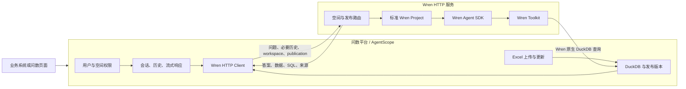

# Wren 问数底座替换计划

更新日期：2026-09-21  
状态：S0–S5 全部完成，S5 于 2026-09-21 通过最终验收，证据位于 `validation-wren/S5-20260921-r1/`。此前 SQLite + 自定义 NL2SQL 的 P0–P2 实现仅作为技术验证，目标架构不继续扩展这条路径。当前业务问数入口已经切换为 AgentScope 会话薄层调用 Wren HTTP；问数平台不再承担问题理解、SQL 生成、执行或二次回答模型编排。

## 1. 最终目标

本次改造只解决一件事：**把现有问数底座完整替换为 Wren，Wren 已有的能力不在问数平台重复实现。**

最终约束：

1. 两个项目、两个服务，通过 HTTP 集成。
2. `ai-query-question-understanding` 是问数平台，负责用户、空间、AgentScope 会话、Excel、发布版本和页面。
3. `WrenAI/services/wren-http` 是通用问数引擎服务，负责 Wren Project、Wren Agent、语义上下文、SQL 规划和查询。
4. 分析数据、平台控制数据、会话与幂等状态首版全部使用 DuckDB，不再新增 SQLite。
5. PostgreSQL 保留后续切换能力，但当前不可用的 PG 环境不阻塞 DuckDB 首版。
6. 原有语义目录、问题理解、SQL 生成、SQLite 查询和回答模型编排在切换完成后删除，不做长期双轨。
7. 飞书只保留来源适配接口，本次不接入。

### 1.1 编码风格：显式组合、线性流程

本项目采用接近 Go 服务的“显式组合根 + 手工构造函数注入 + 线性应用流程”。这不是为了套用复杂的 Clean Architecture 模板，而是让维护者从入口开始，沿普通函数调用一直读到 Wren HTTP 和 DuckDB。

参考依据：

- [Google Go Style Guide](https://google.github.io/styleguide/go/guide.html) 将 clarity、simplicity 和从上到下可读放在首位。
- [Google Go Best Practices：Dependency Injection](https://google.github.io/styleguide/go/best-practices.html#dependency-injection) 建议通过构造函数、函数参数、方法或结构字段沿调用链显式传递依赖。
- [Uber Go Style Guide：Avoid init](https://github.com/uber-go/guide/blob/master/style.md#avoid-init) 建议避免依赖初始化顺序、环境状态、文件或网络 I/O 的 `init()` 魔法。
- [Uber Go Style Guide：Avoid Mutable Globals](https://github.com/uber-go/guide/blob/master/style.md#avoid-mutable-globals) 建议用依赖注入替代可变全局对象。
- [Google Wire Guide](https://github.com/google/wire/blob/main/docs/guide.md) 展示的目标也是生成接近人工编写的普通调用代码；本项目规模不需要 Wire 类容器，直接手写组合代码更容易读。

强制规则：

1. 只有入口文件读取环境变量；业务模块不自行读取 `.env`。
2. 所有数据库、HTTP客户端、Wren Toolkit、AgentScope会话仓储和模型对象都在组合根显式创建。
3. 不使用依赖注入容器、service locator、反射扫描、装饰器自动注册或 import 副作用。
4. `__init__.py` 只做必要的公开符号导出，不创建连接、不注册路由、不加载模型。
5. 构造函数只校验参数和保存依赖，不访问网络、文件或数据库。
6. 外部资源通过名称明确的 `open_*`、`build_*` 或 `connect_*` 函数创建，并返回可关闭对象。
7. 模型对象必须在代码中看得见：模型提供商、Base URL、模型名和用途由一个明确函数构造，不能由框架根据全局状态自动发现。
8. HTTP路由只做解析、鉴权、调用一个应用函数和转换错误，不放业务逻辑。
9. 一个用例由一个公开函数或一个小服务方法串起来；私有辅助函数按调用顺序放在其后。
10. 不创建 `BaseService`、`BaseManager`、通用 Repository 工厂等无实际行为的抽象层。
11. 先使用具体类型；只有调用方确实需要替换外部边界时，才在调用方附近定义小 `Protocol`。
12. Pydantic用于HTTP和配置边界；内部稳定数据优先使用带类型的 dataclass，不在业务流程中传递任意 `dict`。
13. 错误在产生处保留原因，只在HTTP边界转换一次；不层层捕获、改写再抛出。
14. 后台任务必须有显式 `start()`、`stop()`/`close()`；不在导入或构造时偷偷启动线程、协程或模型连接。
15. 删除无调用代码，而不是为旧路径增加兼容开关。

### 1.2 两个服务都只有一个组合根

问数平台入口应能从上到下直接读懂：

```python
def create_app(settings: Settings) -> FastAPI:
    control_store = open_control_duckdb(settings.control_database)
    conversation_store = DuckDBConversationStore(control_store)
    publication_store = DuckDBPublicationStore(control_store)
    publisher = DatasetPublisher(settings.data_root, publication_store)
    wren = WrenClient(settings.wren_url, settings.wren_token)
    conversations = ConversationService(
        conversation_store=conversation_store,
        publication_store=publication_store,
        wren=wren,
    )

    app = FastAPI(lifespan=lifespan(control_store, wren))
    app.include_router(build_upload_router(publisher))
    app.include_router(build_conversation_router(conversations))
    return app
```

Wren HTTP入口同样显式：

```python
def create_app(settings: Settings) -> FastAPI:
    projects = ProjectRegistry(settings.projects_root)
    model = build_bailian_model(
        api_key=settings.model_api_key,
        base_url=settings.model_base_url,
        model_name=settings.model_name,
    )
    runtime = WrenRuntime(projects=projects, model=model)
    questions = QuestionService(runtime=runtime)

    app = FastAPI(lifespan=lifespan(runtime))
    app.include_router(build_project_router(projects, runtime))
    app.include_router(build_question_router(questions))
    return app
```

`build_bailian_model()` 只做一件事：根据显式参数返回模型客户端。它不能读取全局配置、创建Wren项目、注册路由或启动任务。模型为什么存在、由谁使用，在组合根中一眼可见。

### 1.3 每轮问数是一条可顺序阅读的调用链

问数平台的核心流程固定为：

```python
async def send_message(command: SendMessage) -> MessageResult:
    conversation = conversation_store.require(command.conversation_id)
    authorize(command.user_id, conversation.workspace_id)
    publication = publication_store.require_active(conversation.workspace_id)
    history = conversation_store.load_history(conversation.id)

    result = await wren.ask(
        workspace_id=conversation.workspace_id,
        publication_id=publication.id,
        request_id=command.request_id,
        question=command.text,
        history=history,
    )

    conversation_store.append_exchange(command, publication, result)
    return MessageResult.from_wren(result)
```

Wren服务的核心流程固定为：

```python
async def answer(command: AskQuestion) -> WrenAnswer:
    project = project_registry.require(
        command.workspace_id,
        command.publication_id,
    )
    toolkit = toolkit_cache.get_or_open(project)
    agent = build_wren_agent(model, toolkit)
    result = await agent.run(command.question, history=command.history)
    return WrenAnswer.from_agent_result(project, result)
```

实际实现可以增加超时、审计和结构化错误，但调用方向不能被事件总线、全局注册表或多层回调隐藏。读者从路由进入后，最多经过“路由 → 用例 → 外部适配器”三层即可看到真实行为。

### 1.4 文件组织与阅读顺序

问数平台目标结构：

```text
app/
  main.py                    # 读取配置，调用 create_app
  bootstrap.py               # 唯一组合根，逐项创建依赖
  settings.py                # 纯配置结构
  conversations/
    models.py                # SendMessage、MessageResult
    service.py               # send_message 主流程
    store.py                 # DuckDB 会话仓储
    api.py                   # HTTP 路由
  datasets/
    models.py
    import_excel.py          # Excel → DuckDB
    publisher.py             # 新版本构建、验证、激活
    store.py
    api.py
  wren_client/
    models.py                # HTTP 请求响应类型
    client.py                # ask/register/validate
  infrastructure/
    duckdb.py                # 连接、事务和关闭
```

Wren HTTP目标结构：

```text
src/wren_http/
  main.py                    # 读取配置，调用 create_app
  bootstrap.py               # 唯一组合根
  settings.py
  projects/
    models.py
    registry.py              # workspace/publication → project
    service.py               # 注册、加载、验证标准 Wren Project
    api.py
  questions/
    models.py
    service.py               # 一轮 Wren Agent 调用
    api.py
  runtime/
    model.py                 # build_bailian_model
    toolkit.py               # open_toolkit/build_wren_agent
    errors.py                # Wren错误到服务错误的单次映射
```

每个文件内部按“公开类型 → 构造函数 → 公开主流程 → 被调用的私有辅助函数”排列。禁止为了目录整齐把一个简单流程拆成大量只转发调用的文件。

### 1.5 改造范围与 Wren 原生代码冻结

本次需要整理的“自有代码”包括：

1. `D:/project/ai-query-question-understanding/app/` 下所有最终保留的生产代码；
2. 该项目的前端、测试、示例脚本、配置和依赖声明；
3. `D:/project/WrenAI/services/wren-http/` 下我们新增的全部代码；
4. 两个服务之间的 HTTP 契约、启动脚本和部署文件。

不是只整理本次新增文件。旧模块完成删除后，所有仍在生产启动路径上的自有代码都必须符合第 1.1–1.4 节的可读性规则。

以下 Wren 原生目录视为上游代码，本次冻结，不做修改：

```text
D:/project/WrenAI/core/
D:/project/WrenAI/sdk/
D:/project/WrenAI/skills/
D:/project/WrenAI/docs/core/
```

接入规则：

- 只使用 Wren 对外公开的 CLI、Project 格式、SDK、Toolkit 和 connector API。
- 不复制 Wren 原生实现到自有项目后修改。
- 不用 monkey patch、修改私有字段或运行时替换 Wren 方法绕过限制。
- 自有 HTTP 层只处理鉴权、项目路由、请求响应转换和资源生命周期，不重写 Wren 已有能力。
- 当前版本缺少的能力先形成最小复现并标记 BLOCKED；不得为了“完成计划”直接修改 `core/` 或 `sdk/`。
- 最终代码审查必须证明上述原生目录无本次业务改动。

### 1.6 全量自有代码处理原则

每个现有文件只能得到以下三种结论之一：

| 结论 | 条件 | 动作 |
| --- | --- | --- |
| 删除 | 职责已被 Wren、DuckDB 新实现或其他保留模块覆盖 | 删除代码、测试、配置、依赖和文档入口 |
| 重写 | 职责仍需要，但调用链隐藏、职责混杂或依赖由全局状态获得 | 按显式组合和线性流程重写 |
| 原样保留 | 职责单一、依赖显式、仍被生产路径直接调用 | 给出调用方和保留理由 |

不允许使用“暂时没时间判断”长期保留文件。阶段验收必须附一份 `code-inventory.json`，记录每个自有生产文件的结论、调用方和对应测试。

需要保留并统一重写风格的主要能力：

- 用户和 workspace 权限；
- AgentScope 会话运行、流式响应和取消；
- DuckDB 会话、任务、数据集与发布仓储；
- Excel 解析、上传、版本和回滚；
- Wren HTTP Client；
- FastAPI 路由和异常转换；
- 前端会话、上传、版本、来源和结果展示。

需要优先删除的主要能力：

- 问数平台的自有语义模型、问题理解、SQL 生成、SQL 修复和 SQL 执行；
- 问数平台的第二套答案模型编排；
- SQLite 发布、会话、查询、测试夹具和依赖；
- Wren HTTP 中自写的模型网关、schema prompt、SQLite 执行器和重复请求数据库；
- 未被生产入口引用的旧接口、DTO、prompt、脚本和回放文件；
- 删除模块专用的抽象基类、工厂、配置项和测试。

全量整理完成后，不保留 `legacy`、`old`、`v2`、`compat` 等目录复制旧实现。需要保留的历史行为由测试和验收证据描述，不靠旧代码继续存在。

## 2. 服务边界



### 2.1 AgentScope 保留什么

AgentScope 继续维护：

- `conversation_id`、用户消息和助手消息；
- 流式输出、取消、同会话串行和不同会话并行；
- 当前 `workspace_id` 和每轮实际使用的 `publication_id`；
- Wren HTTP 请求状态、错误和最终结果持久化；
- 业务系统现有会话接口。

AgentScope 不再负责：

- 业务问题理解和实体绑定；
- 自有语义目录和候选枚举；
- SQL 生成、修复、验证与执行；
- 查询结果的第二套 AI 编排；
- Wren 已经提供的上下文检索和已验证 SQL 召回。

用户对话是问数平台的权威状态。Wren 每次接收裁剪后的必要历史并完成当前一轮，不在服务内再维护第二套用户会话。

### 2.2 Wren 负责什么

Wren HTTP 内部直接使用官方 `wren-pydantic` Toolkit，不再自行拼接一套 schema prompt：

- `WrenToolkit.from_project()` 加载指定大会和发布版本；
- `wren_list_models` 获取可用模型；
- `wren_fetch_context` 检索字段与业务知识；
- `wren_recall_queries` 召回已确认的问题到 SQL 示例；
- `wren_dry_plan` 通过 MDL 规划 SQL；
- `wren_query` 通过 Wren 原生连接器查询 DuckDB；
- `wren_store_query` 只保存已确认成功的问数样例；
- 使用 Toolkit 官方 instructions/system prompt 驱动 Agent；
- 使用 Wren 的模型、关系、视图、指标、RLAC/CLAC 和查询限制。

`wren ask` 只是提示包装工具，不作为服务端执行 API。服务端以 Wren Agent SDK 和 Toolkit 为实际底座。

### 2.3 Wren 能力覆盖矩阵

“接入 Wren 全部能力”在本项目中定义为：**所有与自然语言问数、语义建模、上下文、治理和查询执行直接相关的开源 Wren 能力都进入正式链路并有验收证据。** 不要求为了追求数量接入与本系统无关的云托管、Dashboard 发布或其他数据库连接器。

下列能力是本次必须真实接入的放行项：

| Wren 能力 | 本项目使用方式 | 验收证据 |
| --- | --- | --- |
| 标准 Wren Project | 每个大会发布一个不可变项目目录 | 项目可被 Wren CLI 和 Toolkit 直接加载 |
| MDL models/columns | Excel sheet 生成基础模型和字段说明 | `wren_list_models` 返回真实模型与列 |
| relationships | 多文件关系经确认后写入 Wren | 真实多表 JOIN 只通过关系模型完成 |
| views | 复用 Wren Project 中的标准 View | View 由 Toolkit 规划并查询真实 DuckDB |
| cubes/metrics | 对确认的统计口径定义复用指标 | `/v1/cube-queries` 与 Agent 的 `wren_cube_query` 返回相同真实聚合结果 |
| `knowledge/rules/*.md` | 保存空间级业务定义、空值和口径 | Agent 获取规则且不跨空间 |
| `knowledge/sql/*.md` | 保存审核过的自然语言到 SQL 示例 | Agent 能召回对应示例且不跨空间 |
| `wren context build` | 从项目源文件构建 `target/mdl.json` | 构建成功才允许激活发布 |
| generate-mdl 工作流 | 复用 Wren CLI skill 的步骤生成/审查基础模型 | 产物符合标准项目格式；不再维护自有语义 Schema |
| enrich-context 工作流 | 复用 Wren CLI skill 的步骤完善业务上下文 | instructions、queries、枚举或指标产生可审查变更 |
| `WrenToolkit.from_project()` | Wren HTTP 加载发布项目的唯一入口 | 运行时不直接手工构造第二套 manifest |
| `wren_list_models` | Agent 查询允许使用的模型 | 工具轨迹可见真实调用 |
| `wren_fetch_context` | 按问题检索字段和业务上下文 | 工具轨迹和隔离测试通过 |
| `wren_recall_queries` | 召回已确认的问数样例 | 相似问题可召回，其他大会不可见 |
| `wren_store_query` | 仅成功且确认后的问题/SQL进入记忆 | 失败 SQL 不写入，空间索引独立 |
| `wren_dry_plan` | 执行前展开和检查逻辑 SQL | 复杂查询在执行前有规划记录 |
| `dry_run()` | 需要数据库侧验证时执行只读预检 | 错列、错表在正式查询前失败 |
| `wren_query` | 通过 Wren 原生 DuckDB connector 执行 | 不存在本地执行器或 SQL 回调 |
| `wren_cube_query` | Agent 调用已治理 Cube 指标 | 工具轨迹包含 Cube 调用和真实聚合结果 |
| DuckDB connector | 查询不可变大会发布文件 | 真实 Excel 结果与独立参照一致 |
| Wren Memory | 每个不可变发布使用独立 `.wren/memory` | 成功样例可召回，失败请求不写入，发布间不串用 |
| RLAC/CLAC | 平台把用户和大会作为 session properties 传给 Wren | 无属性拒绝、行权限过滤、列权限分级均由 Wren 引擎验证 |
| 查询上限与结构化错误 | 使用 Toolkit 的限制、phase/code 和重试语义 | 超行数、规划错误、连接错误可区分 |
| 官方 Agent instructions | 使用 Toolkit 生成的 instructions 驱动工具选择 | 不再使用自写 schema-to-SQL 系统提示词 |

以下能力保留兼容入口，但不要求首版连接真实环境：

- PostgreSQL及其他 Wren 数据源连接器；
- MCP 形式的 Wren 工具暴露；当前内部边界固定使用 HTTP；
- 多 Wren Project 联邦查询；首版一个请求只绑定一个大会发布项目。

以下能力不属于本次内部问数底座，不作为缺失项：

- Wren Cloud、Git Sync 和商业托管能力；
- GenBI Dashboard 生成、部署到 Vercel/Cloudflare；
- dlt/SaaS 数据源同步；本次数据源是 Excel，飞书只预留入口；
- LangChain 适配器；本项目选择功能等价的官方 `wren-pydantic` 适配器，避免同时维护两套 Agent 框架。

如果某项“必须接入”能力经当前锁定版本实测不可用，验收状态必须记为 BLOCKED，并保留复现；不能悄悄用问数平台自写同名能力替代。

## 3. 全部切换到 DuckDB

目标运行链路不再使用 SQLite。

### 3.1 数据文件

每个大会的每次成功发布生成一个不可变 DuckDB 文件：

```text
data/
  workspaces/{workspace_id}/
    publications/{publication_id}/
      data.duckdb
      wren_project/
        wren_project.yml
        models/
        relationships.yml
        views/
        cubes/
        knowledge/
          rules/
          sql/
        target/mdl.json
        .wren/memory/
      publication.json
```

上传新版本时创建新目录；数据、Wren Project 和 MDL 全部验证成功后，才原子切换活动发布指针。查询中的旧版本继续可读，失败版本永不激活。

### 3.2 控制数据

首版使用独立 `control.duckdb` 保存：

- workspace、dataset、source 和 publication；
- 当前活动发布指针；
- 上传任务、幂等键和错误；
- AgentScope 会话与消息；
- Wren HTTP 请求结果和审计摘要。

DuckDB 采用单写入进程或串行写入队列。首版部署一个问数平台写实例，Wren 服务只读发布文件。未来需要多实例并发写入时，将控制库切到 PostgreSQL；分析文件仍可继续使用 DuckDB。

现有 AgentScope `AsyncSQLAlchemyStorage + aiosqlite` 不继续使用。AgentScope 保留会话运行和流式交互，消息、运行状态及恢复快照通过问数平台的 DuckDB 会话仓储读写；不为了保留 AgentScope 而保留 SQLite 存储适配器，也不把 DuckDB 强行套入不支持的异步 SQLAlchemy 驱动。

### 3.3 Excel 更新规则

- 管理端支持一次上传 N 个 `.xlsx`。
- 一个上传的 Excel 文件对应一个 `dataset_id`，也是管理端新增、更新和删除的最小数据集单位；不按单个 sheet 或生成后的物理表单独删除。
- 已指定 `dataset_id` 时更新该数据集；批量入口按“空间 + 规范化来源名”匹配唯一来源。
- 内容哈希不变时不重复发布。
- 更新默认为完整快照替换，不按姓名、序号或证件字段猜测 upsert 主键。
- 一个 sheet 对应一个稳定逻辑模型；多个文件和多个 sheet 可以形成多个模型。
- 不自动建立 JOIN。关系必须通过字段唯一性、匹配率和业务含义验证后写入 Wren relationship。
- 删除采用版本化移除，不增加独立的软删除状态机：从新 publication 的数据集清单中排除该 `dataset_id`，不删除源文件，也不修改或 `DROP` 任何历史 DuckDB 表。
- 新 publication 只从仍在清单中的 Excel 重建 DuckDB 和 Wren Project；被移除 Excel 对应的全部 sheet、表、models 及依赖它们的语义对象不会进入新版本，同批其他 Excel 不受影响。
- 新版本必须通过 Wren Project 构建和查询验证才允许激活；失败时保持当前活动版本不变，并直接返回 Wren 验证错误，不另建一套依赖分析引擎。
- 恢复统一使用 publication 回滚：把活动指针切回删除前的不可变版本即可恢复数据、表、关系和知识，不需要重新上传 Excel，也不增加单数据集恢复接口。
- 原 Excel、源位置和内容哈希保留用于追溯；查询只读已发布 DuckDB。

## 4. 标准 Wren Project

每个 `workspace_id + publication_id` 对应一个不可变 Wren Project。大会隔离由项目目录、DuckDB 文件、访问令牌和发布路由共同保证。

发布流程：

```text
Excel → DuckDB 物理表
      → 生成或复用 Wren models/relationships/views
      → 写入 knowledge/rules 与 knowledge/sql
      → wren context build
      → Wren Toolkit 加载
      → list_models + dry_plan + query 验证
      → 激活 publication
```

规则：

- Wren Project 是唯一语义来源，不再保存另一套可独立编辑的业务语义目录。
- 纯数据更新且结构兼容时复用模型和知识。
- 列新增、删除、重命名、类型变化或关系失效时重新构建并验证。
- 自动生成只覆盖可从表结构确定的基础模型；不确定的指标和关系保持未配置，不让模型猜测。
- 大会业务差异只存在于项目文件，不写入 Wren HTTP 的 Python 分支。
- Wren Memory 按发布或空间隔离；只索引当前项目上下文和已确认 SQL。

## 5. HTTP 契约

### 5.1 问数平台对外

| 接口 | 用途 |
| --- | --- |
| `POST /api/v1/workspaces/{id}/uploads` | 多文件上传，自动新增或更新 |
| `GET /api/v1/workspaces/{id}/datasets` | 数据集、来源和模型状态 |
| `DELETE /api/v1/workspaces/{id}/datasets/{dataset_id}` | 按上传的 Excel 从新发布清单中移除整个数据集 |
| `GET /api/v1/workspaces/{id}/publications` | 发布历史与当前版本 |
| `POST /api/v1/workspaces/{id}/publications/{pid}/activate` | 回滚或切换版本 |
| `POST /api/v1/workspaces/{id}/relationships` | 验证字段关系并创建新的不可变发布 |
| `POST /api/v1/conversations` | 创建 AgentScope 会话并绑定空间 |
| `POST /api/v1/conversations/{id}/messages` | 保存消息并调用 Wren |
| `GET /api/v1/conversations/{id}` | 恢复历史、结果、来源和版本 |

### 5.2 问数平台调用 Wren

Wren HTTP 保持少量通用接口：

| 接口 | 用途 |
| --- | --- |
| `POST /v1/admin/publications` | 校验并注册不可变 Wren Project 发布 |
| `POST /v1/models` | 列出指定发布中的 Wren 模型 |
| `POST /v1/sql-plans` | 使用 Wren Core 展开逻辑 SQL |
| `POST /v1/sql-dry-runs` | 使用 Wren 数据源做只读预检 |
| `POST /v1/sql-queries` | 使用官方 Wren Toolkit 规划并执行查询 |
| `POST /v1/cube-queries` | 查询标准 Wren Cube 的维度与指标 |
| `POST /v1/questions` | 使用 Wren Agent 和 Toolkit 完成一轮问数 |
| `GET /health` | 服务、模型、Toolkit 和发布根目录状态 |

普通问数请求不能提交任意文件路径、DSN、模型内容或外部 URL。Wren 服务根据已注册的 `workspace_id + publication_id` 解析项目和只读 DuckDB 文件。

问数响应至少包含：

- `workspace_id`、`publication_id`、`request_id`；
- 状态、答案、表格结果和是否截断；
- Wren 逻辑 SQL 和目标 SQL；
- 实际引用的 model、dataset、source、sheet 和内容哈希；
- Wren 工具调用轨迹和模型调用数；
- 澄清、能力不支持或执行错误的结构化信息。

## 6. 必须删除的冗余代码

删除是切换的一部分，不放到无限期的“以后清理”。新链路通过闭环后，同一阶段删除对应旧实现和测试。

### 6.1 问数平台删除项

以下模块的业务职责全部由 Wren 取代：

| 现有代码 | 处理方式 |
| --- | --- |
| `app/modules/semantic_catalog/` | 删除；业务语义迁入 Wren Project |
| `app/modules/question_understanding/` | 删除；问题理解和澄清交给 Wren Agent |
| `app/modules/query_execution/` | 删除；SQL 和执行交给 Wren Toolkit |
| `app/modules/answer_presentation/` 中的模型编排 | 删除；页面只渲染 Wren 结果 |
| `app/orchestration/query_workflow.py` | 删除旧多节点工作流，改为薄的 Wren 调用流程 |
| 固定报名/活动/参与关系的数据准备代码 | 删除，改为通用 Excel → DuckDB |
| SQLite 数据适配器、自定义函数和测试夹具 | 删除 |
| 旧 prompt、旧模型路由和旧回放样例 | 无其他引用后删除 |
| 只覆盖被删除实现的测试 | 删除，保留用户行为要求并改写为 Wren 闭环测试 |

`app/modules/wren_query/`、数据集发布模块和 AgentScope 会话代码保留，但要改为 DuckDB 与新 Wren 契约。前端结果组件可以保留展示能力，不能继续调用旧阶段接口。

### 6.2 Wren HTTP 删除项

| 当前过渡代码 | 处理方式 |
| --- | --- |
| `sqlite_executor.py` | 删除，使用 Wren 原生 DuckDB connector |
| `model_gateway.py` | 删除，模型交给 Wren Agent SDK 的 provider |
| `question.py` 中自写 schema prompt/JSON SQL 决策 | 删除，改用 `WrenToolkit` 工具循环 |
| `service.py` 中 DuckDB→SQLite 转译 | 删除 |
| `manifest_b64` 临时注册方式 | 替换为标准 Wren Project 注册 |
| Wren 服务内第二份会话/结果数据库 | 删除；幂等权威状态回到问数平台 `control.duckdb` |
| 只验证自定义 SQLite 路径的测试 | 删除或改写为官方 Toolkit 闭环 |

Wren `core/` 默认不修改。HTTP 服务优先组合官方包；只有已复现的上游缺陷才考虑修改 core。

### 6.3 依赖清理

完成切换后审计并删除不再引用的依赖，目标包括：

- `aiosqlite`；
- 仅供旧语义目录或旧模型节点使用的包；
- 仅供自写 SQLite 执行和方言转译使用的代码依赖；
- Wren HTTP 自写 OpenAI HTTP 网关依赖。

保留 AgentScope 本体，但不因保留 AgentScope 而继续安装或装配旧问数模块。

## 7. 六个实施阶段与独立闭环

本项目一共分为 **6 个阶段：S0–S5**。每个阶段都是可单独审查和验收的交付，不把后续阶段的成功倒算成前一阶段通过。

### 7.1 所有阶段统一验收机制

每个阶段开始前冻结任务和预期，完成后创建独立证据目录：

```text
validation-wren/{stage}-{run_id}/
  manifest.json          # 阶段、代码文件哈希、依赖、非敏感配置
  tasks.json             # 本阶段任务及逐项完成状态
  tests.json             # 自动化测试命令、退出码、数量和耗时
  acceptance.json        # 真实闭环输入、预期、实际结果和状态
  deletions.json         # 删除文件、依赖、配置和无引用检查
  code-inventory.json    # 自有生产文件：删除/重写/保留、调用方、测试
  handoff.md             # 下一阶段只需读取的交接摘要
  report.md              # PASS/FAIL/BLOCKED、限制和下一阶段准入结论
```

状态只允许：

- `PASS`：任务、测试、真实闭环、删除检查和代码可读性检查全部通过；
- `FAIL`：已执行但结果不符合冻结预期；
- `BLOCKED`：外部环境或上游公开能力确实不可用，并有复现证据；
- `NOT_RUN`：尚未执行，不能作为完成。

每个阶段必须同时完成五类检查：

1. **行为测试**：调用公开函数验证本阶段业务规则。
2. **边界测试**：使用真实 HTTP、真实 DuckDB 或真实 Wren Toolkit，不用 mock 替代被验收边界。
3. **真实闭环**：从该阶段的实际入口走到实际输出，并用独立方法核对结果。
4. **删除检查**：确认被替换文件、依赖、配置和生产引用已经删除。
5. **可读性检查**：从入口到结果可顺序阅读，依赖和资源生命周期显式。

通用代码可读性断言：

- 从 `main.py` 能找到唯一 `create_app(settings)`；
- 从 `create_app` 能看到全部数据库、HTTP客户端、模型和服务对象；
- 除入口配置模块外，业务模块不读取环境变量；
- 模块导入不打开文件、数据库、网络连接，也不启动后台任务；
- 没有全局可变 service、模型、数据库连接或字符串 service locator；
- 路由调用具有完整命名参数的应用函数，不使用不透明 `**kwargs`；
- 新抽象必须有两个以上真实调用方或明确的外部替换边界；
- Wren 原生 `core/`、`sdk/`、`skills/` 和 `docs/core/` 没有业务修改。

只有本阶段 `report.md` 为 PASS，才能宣布该阶段完成并进入下一阶段的正式实现。失败记录保留，修复后使用新的 `run_id` 重跑。

### 7.2 阶段交接与上下文压缩

每个阶段完成后可以压缩当前对话上下文，或为下一阶段新建任务。压缩前必须完成以下交接，确保后续工作不依赖聊天记录：

1. 更新本计划中的当前阶段状态和下一阶段入口。
2. 写完本阶段 `report.md`，明确 PASS/FAIL/BLOCKED、测试数量、真实验收结果和已知限制。
3. 写完 `deletions.json` 和 `code-inventory.json`，记录已删除及仍需处理的文件。
4. 写 `handoff.md`，只包含下一阶段真正需要的信息：当前架构、关键文件、公开接口、启动命令、测试命令、未决问题和下一步第一项任务。
5. 记录代码工作区状态和本阶段文件哈希；确认没有仍在运行的测试、服务或未完成写入。
6. API Key、数据库密码和个人数据不写入交接文件，只记录对应环境变量名称。

下一阶段恢复时固定按以下顺序读取：

```text
plan.md
→ 上一阶段 report.md
→ 上一阶段 handoff.md
→ code-inventory.json 中本阶段涉及的文件
→ 开始本阶段第一项任务
```

上一阶段的大段命令输出、调试过程和已否决方案不带入新上下文。需要追溯时再按证据路径读取。这样每个阶段都可以从较干净的上下文开始，同时不丢失验收事实和架构约束。

### S0：代码基线、组合根和删除清单

目标：先把依赖和调用路径摆到明面上，确定每个自有文件最终去留。

任务：

- 为两个服务建立唯一 `main.py → bootstrap.create_app(settings)` 启动路径；
- 配置只在入口加载，显式构造当前仍需使用的依赖；
- 生成首版 `code-inventory.json`，覆盖全部自有生产文件；
- 记录 Wren 原生目录基线哈希，后续阶段持续比较；
- 删除已确认无生产调用方的死代码、重复入口和无效配置；
- 固定后续 S1–S5 使用的合成夹具、真实 Excel 本地夹具和独立预期。

自动化验收：

- 两个服务可由唯一入口启动并通过 `/health`；
- 模块导入无文件、网络、数据库和后台任务副作用；
- 当前可保留行为的基线测试通过；
- `code-inventory.json` 文件数与自有生产源码清单一致。

真实闭环：从管理 HTTP 上传一个最小合成 Excel，并从当前问数 HTTP 完成一次基线查询。该结果只证明基线可运行，不放行旧架构。

删除验收：所有重复启动入口、无引用模块和确认废弃的配置已删除；尚待后续替换的文件必须在 inventory 中标明删除阶段。

阶段输出：`validation-wren/S0-{run_id}/`。放行条件是入口唯一、依赖显式、文件去留完整、Wren 原生代码无改动。

### S1：全部切换 DuckDB

目标：新运行路径不再产生或依赖 SQLite。

任务：

- Excel发布改为每版本一个不可变 `data.duckdb`；
- 新建 `control.duckdb` 保存空间、数据集、发布、任务、会话和幂等状态；
- AgentScope改用显式 DuckDB会话仓储；
- 保留内容哈希、两阶段激活、失败保旧和回滚；
- 删除 SQLite发布器、会话存储、执行器、自定义函数和 `aiosqlite`。

自动化验收：

- 首次上传、相同内容重复上传、已有数据更新、删除行、损坏文件、失败保旧、并发顺序和回滚测试通过；
- DuckDB仓储重启恢复、事务和单写入队列测试通过；
- 全项目运行路径搜索不到 SQLite连接创建和 `aiosqlite` 引用。

真实闭环：真实 Excel 通过管理 HTTP 上传，生成 DuckDB；用独立 DuckDB SQL 核对 sheet、行列数、更新内容和回滚版本，不调用外部模型。

删除验收：旧 `.db` 发布逻辑、SQLite适配器、依赖和专用测试全部删除；运行目录只产生 `.duckdb`。

阶段输出：`validation-wren/S1-{run_id}/`。放行条件是上传、更新、回滚全部使用 DuckDB 且零 SQLite运行依赖。

### S2：标准 Wren Project 与官方 Toolkit

状态：**PASS（2026-09-20，证据：`validation-wren/S2-20260920-r1/`）**。当前 Wren v5 使用 `knowledge/rules/` 与 `knowledge/sql/` 取代旧版 `instructions.md` 与 `queries.yml`；S2 按 v5 标准生成知识目录和规则文件，后续 S3 在其中接入 Agent context 与 memory。

目标：数据查询完全进入标准 Wren Project 和官方 Toolkit，不保留本地执行器。

任务：

- 每个发布生成 `wren_project.yml`、models、relationships、views、cubes、`knowledge/rules`、`knowledge/sql` 和 `target/mdl.json`；
- 使用 `wren context build` 构建项目；
- 使用 `WrenToolkit.from_project()` 加载项目；
- 真实调用 list models、dry plan、dry run和 query；
- 建立两个同名模型、不同数据的 workspace验证隔离；
- 删除 `manifest_b64` 注册、手工manifest加载和 DuckDB→SQLite转译。

自动化验收：

- Project构建、结构变化、模型复用、坏模型阻止激活测试通过；
- Toolkit结构化错误、查询上限、只读限制测试通过；
- 两空间项目路由和token鉴权测试通过。

真实闭环：合成多表DuckDB经标准Project构建后，由官方Toolkit完成单表统计和relationship JOIN；结果与独立SQL一致，工具之外不存在查询执行回调。

删除验收：`sqlite_executor.py`、旧 planner 转译、临时manifest注册及对应测试删除；生产路径只调用Wren公开API。

阶段输出：`validation-wren/S2-{run_id}/`。放行条件是所有分析SQL由Wren原生DuckDB connector执行，Wren原生目录无修改。

### S3：Wren Agent自然语言问数

状态：**PASS（2026-09-20，证据：`validation-wren/S3-20260920-r1/`）**。

目标：自然语言理解、上下文、SQL和查询工具选择全部由Wren官方Agent SDK承担。

任务：

- 显式构造百炼模型、`wren-pydantic` Toolkit和Agent；
- 接入 list models、fetch context、recall queries、dry plan、query和受控store query；
- 接入 Wren v5 `knowledge/rules/`、`knowledge/sql/` 和隔离的 Wren Memory；
- `/v1/questions` 返回答案、表格、SQL、来源和工具轨迹；
- 删除自写 `QuestionService`、`model_gateway`、schema prompt和Wren侧请求结果库。

自动化验收：

- 工具选择、澄清、无数据、错误映射、超时和结果结构测试通过；
- 失败SQL不写memory，成功确认样例可召回；
- 两空间context、query memory和toolkit cache不串用。

真实闭环：使用无个人信息的合成Excel和真实百炼API执行总数、筛选、分组、多表、连续追问、澄清和无数据问题；证据必须显示实际Wren工具调用，并与独立SQL逐题核对。

删除验收：Wren HTTP中所有自写NL2SQL、答案模型网关和SQLite请求存储删除；依赖中不再包含只为这些实现服务的包。

阶段输出：`validation-wren/S3-{run_id}/`。放行条件是自然语言问题经Wren Agent和官方工具完成，平台或HTTP封装没有第二套问数逻辑。

### S4：AgentScope会话切换与旧问数链路删除

状态：**PASS（2026-09-21，证据：`validation-wren/S4-20260921-r1/`）**。平台消息入口已收敛为“会话与权限 → 活动发布 → 一次 Wren HTTP → 保存结果”；旧语义目录、问题理解、SQL执行、答案模型编排、模型路由和可执行回放脚本已删除。真实百炼闭环完成连续追问、平台重启恢复、重新上传和新发布绑定。

目标：现有业务问数入口只做会话管理并调用一次Wren HTTP。

任务：

- 将消息入口改为“读取会话 → 权限 → 活动发布 → Wren Client → 保存结果”；
- AgentScope保留流式输出、取消、同会话串行和重启恢复；
- 页面展示Wren答案、数据、SQL、来源和发布版本；
- 删除 `semantic_catalog`、`question_understanding`、`query_execution`、旧answer模型编排和旧workflow；
- 删除旧prompt、DTO、模型路由、回放脚本、依赖和只覆盖旧实现的测试。

自动化验收：

- 会话创建、连续追问、重复请求、取消、并发和重启恢复测试通过；
- 权限和publication绑定测试通过；
- 生产装配和import graph不再引用旧问数模块。

真实闭环：从真实业务HTTP或浏览器入口创建会话，连续问两轮，刷新或重启后恢复，再上传新版本并确认后续问题绑定新publication。

删除验收：第6.1节旧问数模块及专用依赖实际删除；不保留兼容分支，也不在Wren失败时回退旧链路。

阶段输出：`validation-wren/S4-{run_id}/`。放行条件是AgentScope只管理对话，问数平台没有SQL和语义推理代码。

### S5：管理端、全部Wren能力与最终清理

状态：**PASS（2026-09-21，证据：`validation-wren/S5-20260921-r1/`）**。

目标：完成可直接使用的管理端，并对全部保留代码和Wren能力做最终放行。

任务：

- 完成N文件上传、任务状态、数据集、按Excel维度版本化移除、发布历史、激活/回滚、模型状态和试问页面；
- 使用第二类Excel、多文件、多表和同名表验证通用性；
- 完成第2.3节Wren能力矩阵，包括 views、cubes/metrics、knowledge rules、knowledge SQL、memory 及 RLAC/CLAC 隔离夹具；
- 完成所有自有代码盘点，删除无调用文件，重写不符合第1节规则的保留代码；
- 清理最终依赖、配置、文档入口和构建产物；飞书只保留`SourceAdapter`契约。

自动化验收：

- 两个项目完整测试、静态检查、依赖检查和前端构建通过；
- `code-inventory.json` 没有待判断文件；
- 全部生产文件均有真实调用方和对应测试；
- Wren原生目录与S0基线一致。

真实闭环：管理员上传多个文件并立即问数；移除其中一个Excel后，该文件的全部sheet、表和模型在新活动版本中均不可查询，其他Excel保持可用，历史DuckDB及源文件未被修改；回滚到删除前的publication后完整恢复问数且无需重传Excel；新Wren Project验证失败时当前版本不切换；再执行版本更新和回滚；两个大会使用同名文件、sheet和模型并发问数不串数据，删除一个大会的Excel不影响另一个大会；用合成权限夹具验证RLAC/CLAC；浏览器完成完整操作。

删除验收：源码不存在SQLite、旧问数模块、无引用prompt、兼容目录和废弃配置；运行目录不产生SQLite；Wren HTTP无大会专用代码。

阶段输出：`validation-wren/S5-{run_id}/`。放行条件是功能、隔离、可读性、删除清单和Wren能力矩阵全部PASS。S5通过即完成本次底座替换。

## 8. 删除完成标准

只有同时满足以下条件，才算“问数底座已换成 Wren”：

- 生产问数路径实际使用官方 Wren Agent SDK 和 Toolkit；
- 所有分析查询由 Wren 原生 DuckDB connector 执行；
- 问数平台不再生成、修复或执行 SQL；
- 问数平台不再维护业务语义目录；
- AgentScope 只维护对话、调用状态和流式交互；
- 新运行目录不产生 SQLite 文件；
- 旧问数模块、prompt、适配器、依赖和仅覆盖旧实现的测试已经删除；
- 不存在“新链路失败后静默切回旧链路”的回退；
- 真实 Excel、第二类 Excel、多文件、多表、按Excel维度版本化移除与整版本回滚、连续追问、重启和大会隔离验收通过。
- 第 2.3 节所有“必须真实接入”的 Wren 能力均有工具轨迹、项目产物或查询结果证据。
- `code-inventory.json` 中不存在“待判断”文件，生产源码不存在无调用模块。
- Wren 原生 `core/`、`sdk/`、`skills/` 和 `docs/core/` 没有本次业务修改。

## 9. 已完成工作的处置

可以保留并迁移：

- Excel 多文件上传和稳定 `dataset_id`；
- 内容哈希幂等、不可变发布、两阶段激活和回滚；
- 来源元数据和 `workspace_id` 隔离；
- 问数平台到 Wren 的 HTTP 边界；
- 真实验收脚本的输入、预期结果和证据格式。

需要替换后删除：

- SQLite 发布和查询实现；
- 手工生成 manifest 并以 `manifest_b64` 注册的方式；
- 自写 SQL 模型 prompt、答案模型调用和请求结果数据库；
- 问数平台原有完整问数流水线。

此前 SQLite 和自定义 NL2SQL 的验收记录保留为历史证据，但不作为新架构放行依据。S0–S5 每个阶段必须产生独立的 DuckDB/Wren 闭环报告。

## 10. PostgreSQL 与飞书

PostgreSQL保留为后续部署选项。当前候选数据库网络可达，但服务器返回内部文件权限错误，因此不参与首版。切换 PG 时保持 Wren Project 和 HTTP 契约不变，只替换数据发布器、profile 和控制存储。

飞书后续实现同一个 `SourceAdapter`：检测变更后拉取内容，生成标准批次并复用 Excel 之后的 DuckDB、Wren Project、发布和问数流程。本次不实现 OAuth、事件订阅或轮询。
